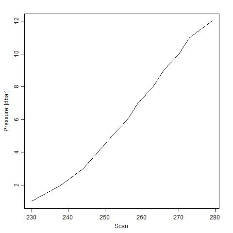

Homework 07 (CTD Version)
================
Yuanji Sun
November 14, 2017

Report process
==============

I learnt a lot from this exercise and am clear about how Makefile works. Below are the problems I ran into.

1.  `rm` does not work in Windows. Instead, I should use `del` to remove/clean files.
2.  It is a good idea to add the files into remove list immediately after finishing the R script. Otherwise, it takes a longer time to find out which one needs to be cleaned.
3.  It is necessary to run the R script/RMD file before finalizing the Makefile. Otherwise, it is really difficult to debug.
4.  If many files of the same type will be produced, I can use `%` to represent the file name. For example, I used `%.png` in Makefile to represent all .png files generated in that step.
5.  It is good that if you render the MD file, a HTML file will also be generated automatically.

The most useful resources I used is the lecture notes (example). Following it step by step is a good way to learn.

CTD Report
==========

In this homework, I created a pipeline to automatically analyze the CTD data, which is unique in Oceanography. CTD measures key factors of seawater, including temperature, salinity, pressure.

**Please note: the package called "oce" must be installed in advance.**

First, let's have a look at the CTD data. What does it look like?

``` r
load("ctd_data.RData")
ctd_data
```

    ## Loading required package: oce

    ## Loading required package: methods

    ## Loading required package: gsw

    ## Loading required package: testthat

    ## ctd object, from file 'C:\Users\yuanj\Desktop\STAT547-hw-Sun-Yuanji\hw07\CTD_version\CTD.cnv', has data as follows.
    ##    scan: 230, 238, ..., 273, 279 (length 12)
    ##    pressure: 1, 2, ..., 11, 12 (length 12)
    ##    temperature: 7.6886, 7.6690, ..., 8.2751, 8.2782 (length 12)
    ##    conductivity: 3.1976, 3.1990, ..., 3.3239, 3.3246 (length 12)
    ##    fluorescence: 0.2032, 0.2052, ..., 0.2405, 0.2265 (length 12)
    ##    salinity: 30.762, 30.793, ..., 31.571, 31.575 (length 12)
    ##    sigmaTheta: 23.990, 24.017, ..., 24.543, 24.546 (length 12)
    ##    flag: 0, 0, ..., 0, 0 (length 12)
    ##    nbin: 2, 8, ..., 4, 4 (length 12)

How about getting the summary of the data?

``` r
summary(ctd_data)
```

    ## CTD Summary
    ## -----------
    ## 
    ## * Instrument:          SBE 
    ## * Temp. serial no.:    2924
    ## * Cond. serial no.:    2924
    ## * File:                C:\Users\yuanj\Desktop\STAT547-hw-Sun-Yuanji\hw07\CTD_version\CTD.cnv
    ## * Original file:       c:\sbe19 data\chickadee\bam01001.hex
    ## * Start time:          2001-02-19 09:06:45
    ## * Sample interval:     1 dbar
    ## * Station:             1
    ## * Location:            48.832N  125.14W 
    ## * Data
    ## 
    ##                                             Min.   Mean    Max.   Dim. OriginalName
    ##     scan                                    230    256.5   279    12   scan        
    ##     pressure [dbar, Strain Gauge]           1      6.5     12     12   prSM        
    ##     temperature [°C, IPTS-68]              7.669  8.0542  8.2782 12   t068C       
    ##     conductivity [S/m]                      3.1976 3.2729  3.3246 12   c0S/m       
    ##     fluorescence [mg/m³, WET Labs WETstar] 0.2032 0.23357 0.2586 12   wetStar     
    ##     salinity [PSS-78]                       30.762 31.231  31.575 12   sal00       
    ##     sigmaTheta [kg/m³]                     23.99  24.308  24.546 12   sigma-é00   
    ##     flag                                    0      0       0      12   flag        
    ##     nbin                                    2      4       8      12   nbin        
    ## 
    ## * Processing Log
    ##     - 2017-11-15 21:50:37 UTC: `create 'ctd' object`
    ##     - 2017-11-15 21:50:38 UTC: `read.ctd.sbe(file = file, processingLog = processingLog)`

    ##                                             Min.     Mean      Max.    
    ##     scan                                    "230"    "256.5"   "279"   
    ##     pressure [dbar, Strain Gauge]           "1"      "6.5"     "12"    
    ##     temperature [°C, IPTS-68]              "7.669"  "8.0542"  "8.2782"
    ##     conductivity [S/m]                      "3.1976" "3.2729"  "3.3246"
    ##     fluorescence [mg/m³, WET Labs WETstar] "0.2032" "0.23357" "0.2586"
    ##     salinity [PSS-78]                       "30.762" "31.231"  "31.575"
    ##     sigmaTheta [kg/m³]                     "23.99"  "24.308"  "24.546"
    ##     flag                                    "0"      "0"       "0"     
    ##     nbin                                    "2"      "4"       "8"     
    ##                                             Dim. OriginalName
    ##     scan                                    "12" "scan"      
    ##     pressure [dbar, Strain Gauge]           "12" "prSM"      
    ##     temperature [°C, IPTS-68]              "12" "t068C"     
    ##     conductivity [S/m]                      "12" "c0S/m"     
    ##     fluorescence [mg/m³, WET Labs WETstar] "12" "wetStar"   
    ##     salinity [PSS-78]                       "12" "sal00"     
    ##     sigmaTheta [kg/m³]                     "12" "sigma-é00" 
    ##     flag                                    "12" "flag"      
    ##     nbin                                    "12" "nbin"

Second, let's have a look at the depth profile of key parameters. In Oceanography, pressure can be used as depth (m). This information is directly obtained and plotted from CTD data. We can see that the temperature and salinity increase with the increase of depth (pressure).




Third, how about doing some calculation and plot based on my need? I can calculate the Sigma of seawater and obrain the following figure. Sigma can be taken as the density of seawater here. We can see that the density increases with the depth.


