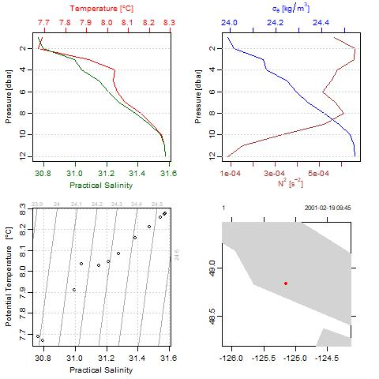
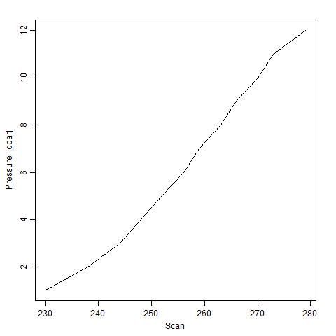
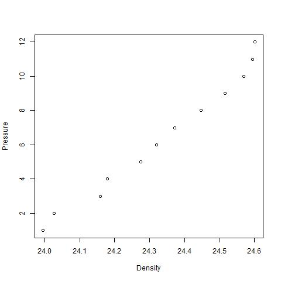

# Report process
I learnt a lot from this exercise and am clear about how Makefile works. Below are the problems I ran into.

1. `rm` does not work in Windows. Instead, I should use `del` to remove/clean files.
2. It is a good idea to add the files into remove list immediately after finishing the R script. Otherwise, it takes a longer time to find out which one needs to be cleaned.
3. It is necessary to run the R script/RMD file before finalizing the Makefile. Otherwise, it is really difficult to debug.
4. If many files of the same type will be produced, I can use `%` to represent the file name. For example, I used `%.png` in Makefile to represent all .png files generated in that step.
5. It is good that if you render the MD file, a HTML file will also be generated automatically.

The most useful resources I used is the lecture notes (example). Following it step by step is a good way to learn.


# CTD Report
In this homework, I created a pipeline to automatically analyze the CTD data, which is unique in Oceanography. CTD measures key factors of seawater, including temperature, salinity, pressure.

__Please note: the package called "oce" must be installed in advance.__

First, let's have a look at the CTD data. What does it look like?
```{r}
load("ctd_data.RData")
ctd_data
```

How about getting the summary of the data?
```{r}
summary(ctd_data)
```

Second, let's have a look at the depth profile of key parameters. In Oceanography, pressure can be used as depth (m). This information is directly obtained and plotted from CTD data. We can see that the temperature and salinity increase with the increase of depth (pressure).





Third, how about doing some calculation and plot based on my need? I can calculate the Sigma of seawater and obrain the following figure. Sigma can be taken as the density of seawater here. We can see that the density increases with the depth.


