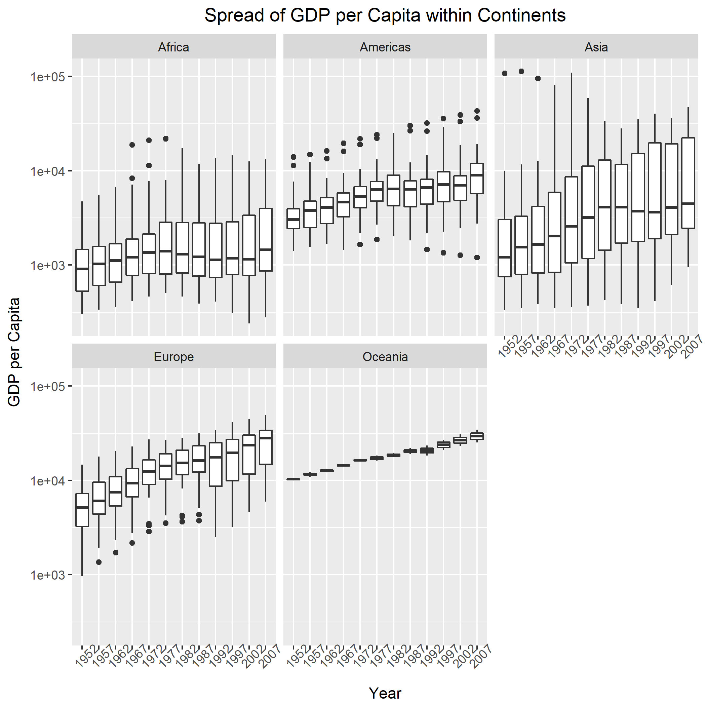
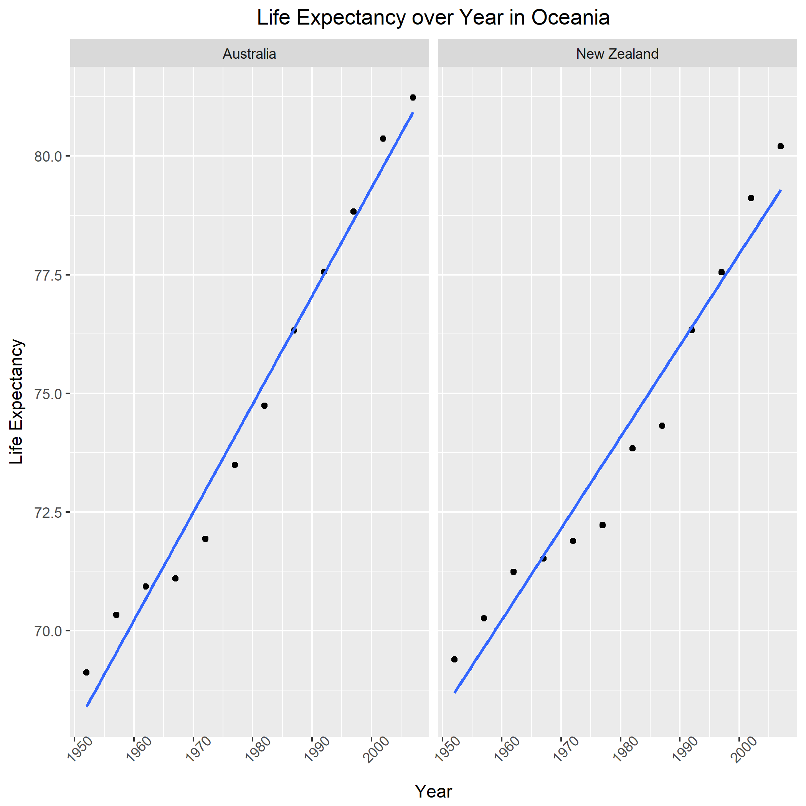

# Report process
I learnt a lot from this exercise and am clear about how Makefile works. Below are the problems I ran into.

1. `rm` does not work in Windows. Instead, I should use `del` to remove/clean files.
2. It is a good idea to add the files into remove list immediately after finishing the R script. Otherwise, it takes a longer time to find out which one needs to be cleaned.
3. It is necessary to run the R script/RMD file before finalizing the Makefile. Otherwise, it is really difficult to debug.
4. I tried to make the last 5 figures in this report larger but I did not find a good way. If I specify the image size, I cannot keep the width/height ratio. I tried to use the package `ggplus` but it is not well developed. So I did not change the image size here.
5. If many files of the same type will be produced, I can use `%` to represent the file name. For example, I used `%.png` in Makefile to represent all .png files generated in that step.
6. It is good that if you render the MD file, a HTML file will also be generated automatically.

The most useful resources I used is the lecture notes (example). Following it step by step is a good way to learn.


# Perform exploratory analyses
In this section, I plotted two figures. Figure 1 shows the min/max GDP/cap of each continent in different years. Figure 2 shows the distribution of GDP/cap over years of each continent.




I also reordered the continent based on the life expectancy and saved the results to `exploratory_analyses.tsv`. Based on this sorted and reordered data, I make another plot which shows the average life expectancy of each continent. (You can see that the continent order is reordered already).


# Perform statistical analyses
In this section, I first read the sorted data from .tsv file from the previous part. The reordered continent is still in force. I made a linear model and used `broom::tidy()` to export the coefficients to a .tsv file. Let's have a look at it.
```{r}
read.table(file="model_result.tsv", sep="\t", skip = 1,
		   col.names=c("Continent", "Country", "Term","Estimate", "Std.Error", "Statistic", "P.Value"))
```

Based on the results above, I ordered countries in each continent __from the best to worst__ according to the intercept value (lowest to largest) and saved the results in seperate .tsv file. This is the so-called best/worst countries based on my criteria. Let's have a look at the results.

Africa (from the worst to the best)
```{r}
read.table(file="Africa.tsv", sep="\t", skip = 1, col.names=c("Country", "Intercept Estimate"))
```

Americas (from the worst to the best)
```{r}
read.table(file="Americas.tsv", sep="\t", skip = 1, col.names=c("Country", "Intercept Estimate"))
```

Asia (from the worst to the best)
```{r}
read.table(file="Asia.tsv", sep="\t", skip = 1, col.names=c("Country", "Intercept Estimate"))
```

Europe (from the worst to the best)
```{r}
read.table(file="Europe.tsv", sep="\t", skip = 1, col.names=c("Country", "Intercept Estimate"))
```

Oceania (from the worst to the best)
```{r}
read.table(file="Oceania.tsv", sep="\t", skip = 1, col.names=c("Country", "Intercept Estimate"))
```

# Generate figures
In this section, I created a figure for each continent, and wrote one file per continent, with an informative name. The figure gives scatterplots of life expectancy vs. year, faceting on country, fitted line overlaid. Here are the figures.





# Automate the pipeline
Since I am using Makefile, there is no need to use `source()`. I made this report.RMD file to put everything together and generate the final report. To update/run all files automatially, simply choose "Build All" to run the Makefile.

[This is the end of Homework 7 (Gapminder Version).]

