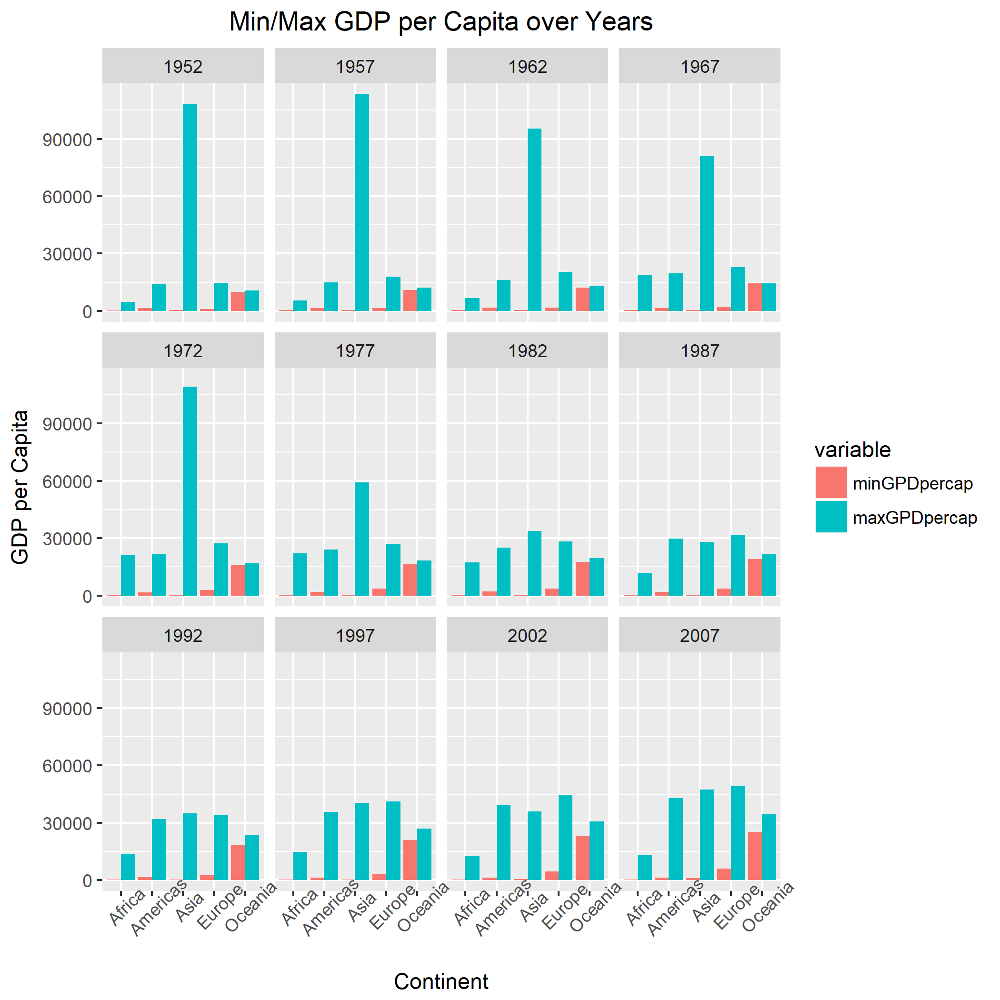
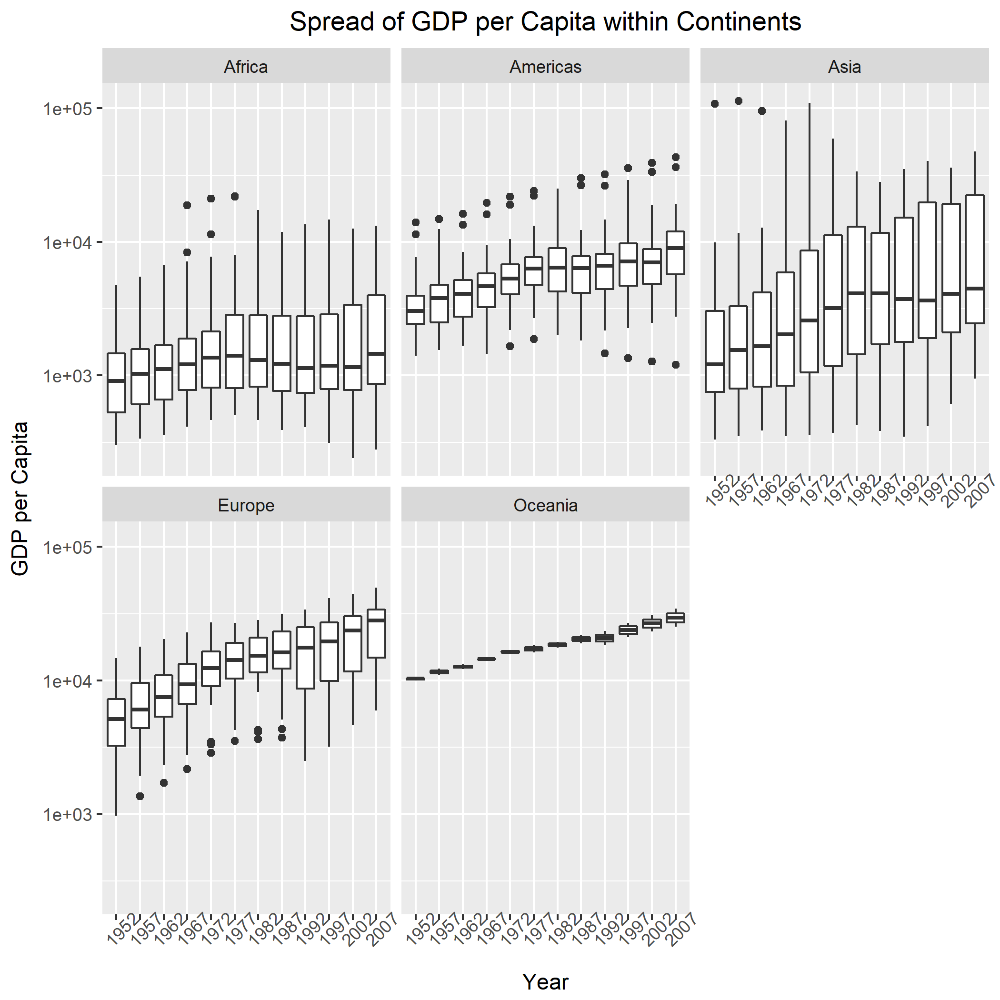
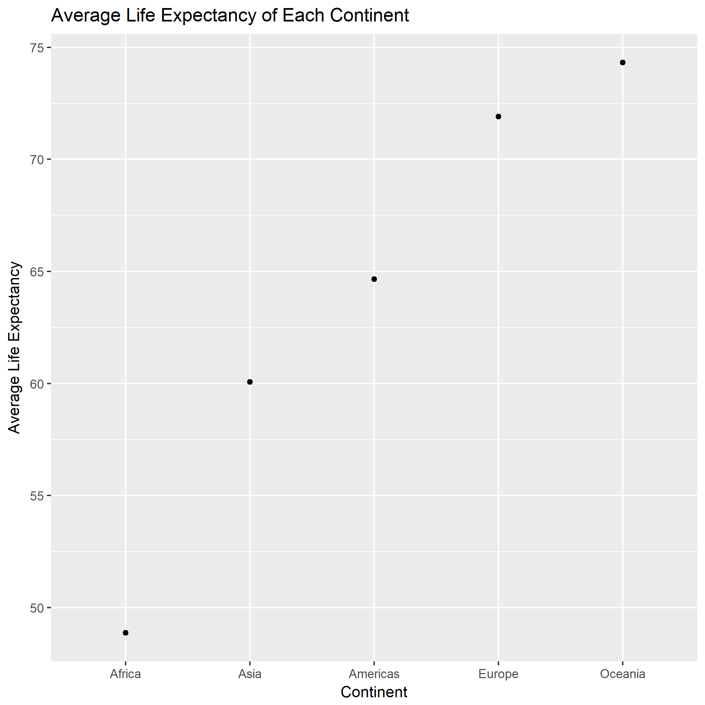
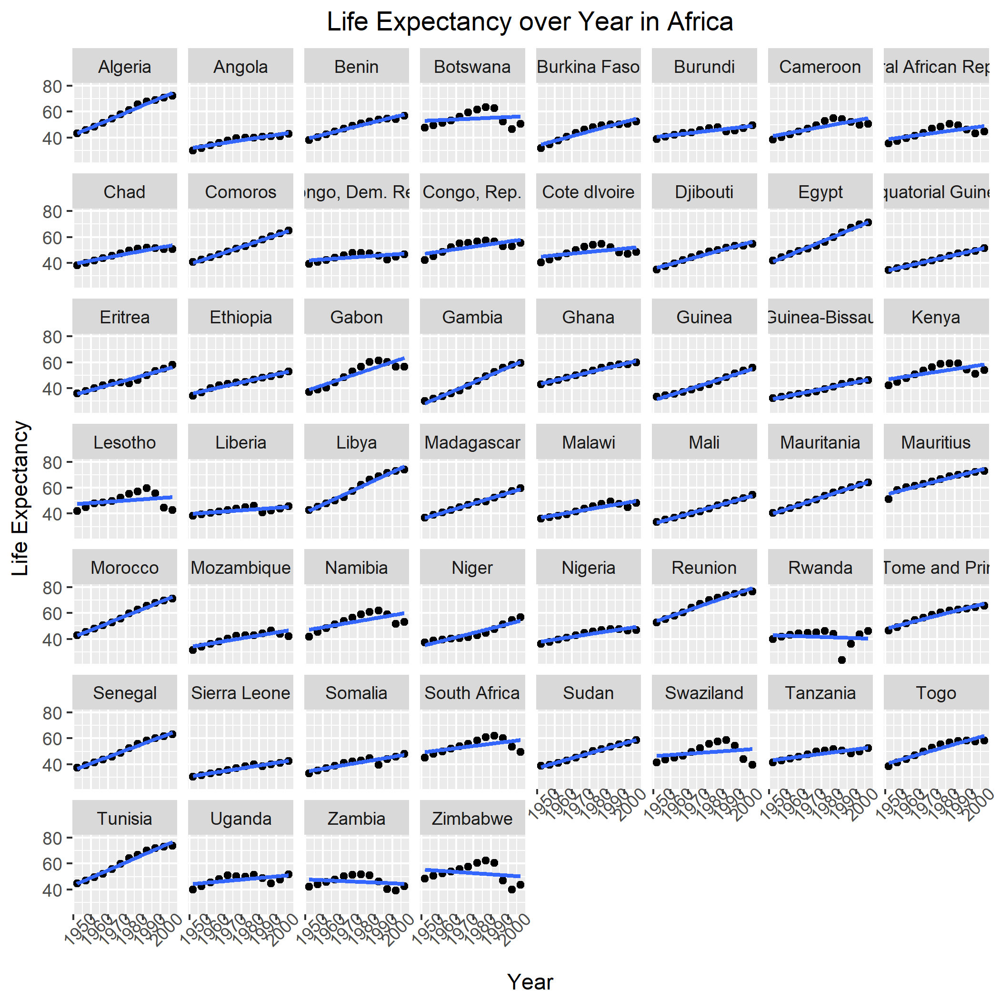
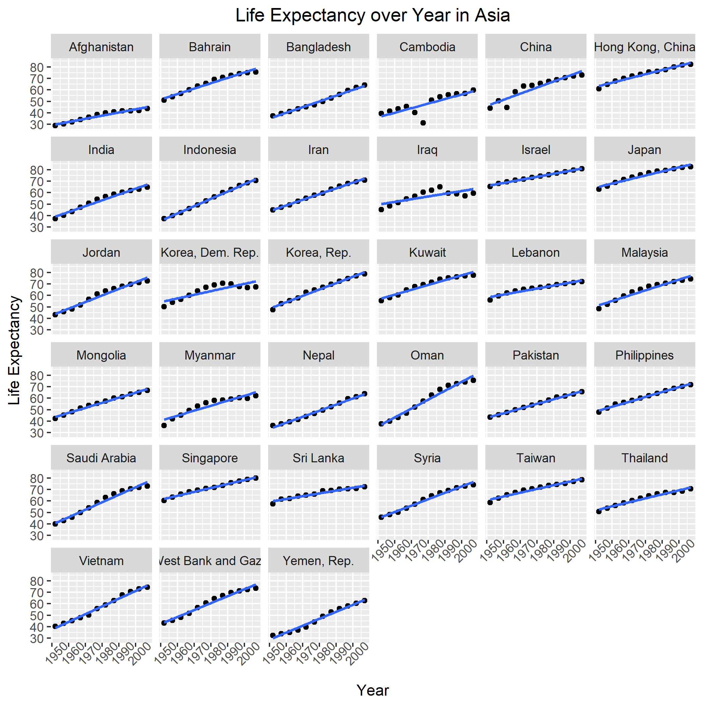
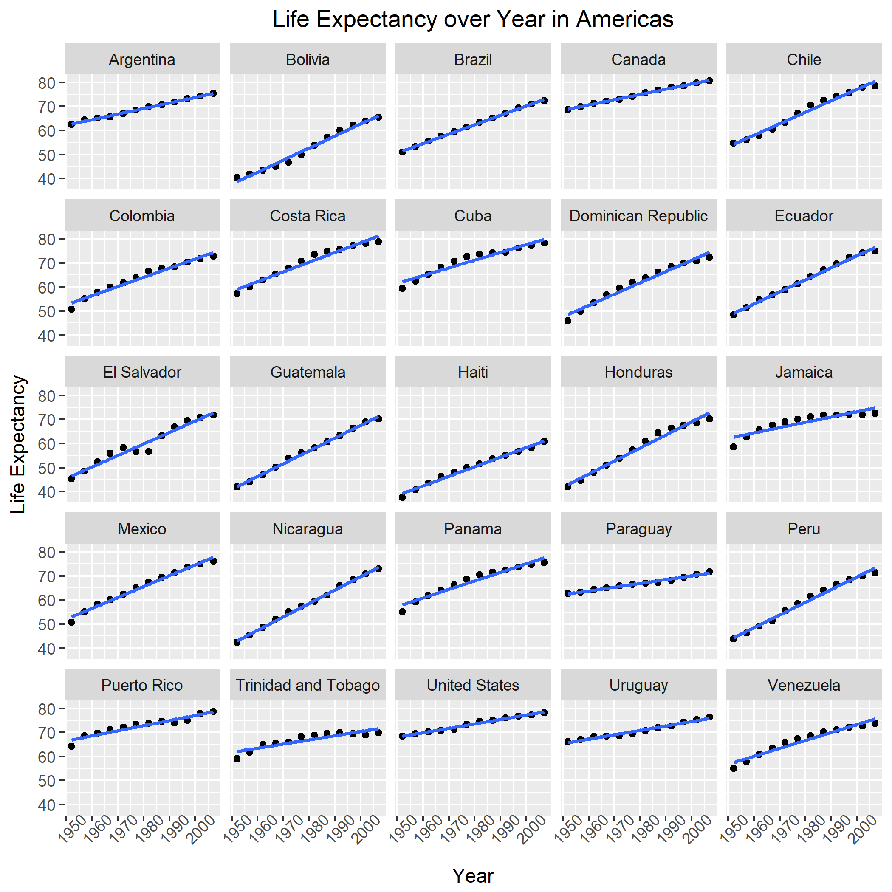
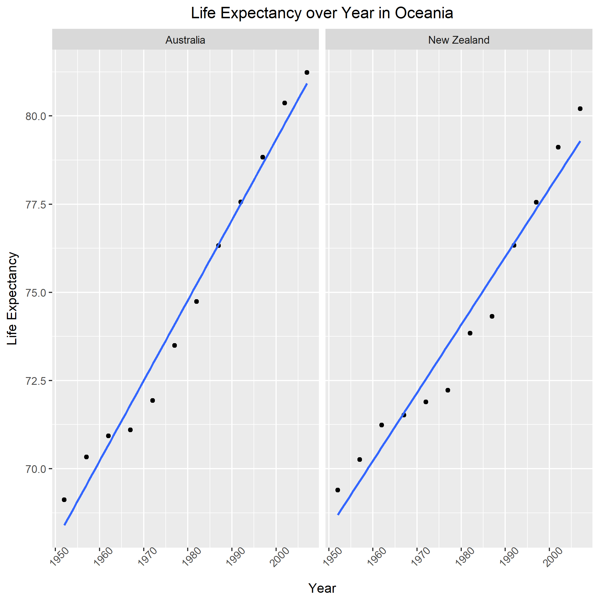

Homework 7 (Gapminder Version)
================
Yuanji Sun
November 14, 2017

Report process
==============

I learnt a lot from this exercise and am clear about how Makefile works. Below are the problems I ran into.

1.  `rm` does not work in Windows. Instead, I should use `del` to remove/clean files.
2.  It is a good idea to add the files into remove list immediately after finishing the R script. Otherwise, it takes a longer time to find out which one needs to be cleaned.
3.  It is necessary to run the R script/RMD file before finalizing the Makefile. Otherwise, it is really difficult to debug.
4.  I tried to make the last 5 figures in this report larger but I did not find a good way. If I specify the image size, I cannot keep the width/height ratio. I tried to use the package `ggplus` but it is not well developed. So I did not change the image size here.
5.  If many files of the same type will be produced, I can use `%` to represent the file name. For example, I used `%.png` in Makefile to represent all .png files generated in that step.
6.  It is good that if you render the MD file, a HTML file will also be generated automatically.

The most useful resources I used is the lecture notes (example). Following it step by step is a good way to learn.

Perform exploratory analyses
============================

In this section, I plotted two figures. Figure 1 shows the min/max GDP/cap of each continent in different years. Figure 2 shows the distribution of GDP/cap over years of each continent.





I also reordered the continent based on the life expectancy and saved the results to `exploratory_analyses.tsv`. Based on this sorted and reordered data, I make another plot which shows the average life expectancy of each continent. (You can see that the continent order is reordered already).



Perform statistical analyses
============================

In this section, I first read the sorted data from .tsv file from the previous part. The reordered continent is still in force. I made a linear model and used `broom::tidy()` to export the coefficients to a .tsv file. Let's have a look at it.

``` r
read.table(file="model_result.tsv", sep="\t", skip = 1,
           col.names=c("Continent", "Country", "Term","Estimate", "Std.Error", "Statistic", "P.Value"))
```

    ##     Continent                  Country             Term    Estimate
    ## 1      Africa                  Algeria        intercept 43.37497436
    ## 2      Africa                  Algeria I(year - offset)  0.56927972
    ## 3      Africa                   Angola        intercept 32.12665385
    ## 4      Africa                   Angola I(year - offset)  0.20933986
    ## 5      Africa                    Benin        intercept 39.58851282
    ## 6      Africa                    Benin I(year - offset)  0.33423287
    ## 7      Africa                 Botswana        intercept 52.92911538
    ## 8      Africa                 Botswana I(year - offset)  0.06066853
    ## 9      Africa             Burkina Faso        intercept 34.68469231
    ## 10     Africa             Burkina Faso I(year - offset)  0.36397483
    ## 11     Africa                  Burundi        intercept 40.57864103
    ## 12     Africa                  Burundi I(year - offset)  0.15413427
    ## 13     Africa                 Cameroon        intercept 41.24946154
    ## 14     Africa                 Cameroon I(year - offset)  0.25014685
    ## 15     Africa Central African Republic        intercept 38.80951282
    ## 16     Africa Central African Republic I(year - offset)  0.18390559
    ## 17     Africa                     Chad        intercept 39.80937179
    ## 18     Africa                     Chad I(year - offset)  0.25324406
    ## 19     Africa                  Comoros        intercept 39.99600000
    ## 20     Africa                  Comoros I(year - offset)  0.45039091
    ## 21     Africa         Congo, Dem. Rep.        intercept 41.96107692
    ## 22     Africa         Congo, Dem. Rep. I(year - offset)  0.09391538
    ## 23     Africa              Congo, Rep.        intercept 47.13678205
    ## 24     Africa              Congo, Rep. I(year - offset)  0.19509580
    ## 25     Africa             Cote dIvoire        intercept 44.84585897
    ## 26     Africa             Cote dIvoire I(year - offset)  0.13055664
    ## 27     Africa                 Djibouti        intercept 36.27715385
    ## 28     Africa                 Djibouti I(year - offset)  0.36740350
    ## 29     Africa                    Egypt        intercept 40.96800000
    ## 30     Africa                    Egypt I(year - offset)  0.55545455
    ## 31     Africa        Equatorial Guinea        intercept 34.43030769
    ## 32     Africa        Equatorial Guinea I(year - offset)  0.31017063
    ## 33     Africa                  Eritrea        intercept 35.69526923
    ## 34     Africa                  Eritrea I(year - offset)  0.37469021
    ## 35     Africa                 Ethiopia        intercept 36.02815385
    ## 36     Africa                 Ethiopia I(year - offset)  0.30718531
    ## 37     Africa                    Gabon        intercept 38.93534615
    ## 38     Africa                    Gabon I(year - offset)  0.44673287
    ## 39     Africa                   Gambia        intercept 28.40037179
    ## 40     Africa                   Gambia I(year - offset)  0.58182587
    ## 41     Africa                    Ghana        intercept 43.49274359
    ## 42     Africa                    Ghana I(year - offset)  0.32174266
    ## 43     Africa                   Guinea        intercept 31.55698718
    ## 44     Africa                   Guinea I(year - offset)  0.42483077
    ## 45     Africa            Guinea-Bissau        intercept 31.73703846
    ## 46     Africa            Guinea-Bissau I(year - offset)  0.27175315
    ## 47     Africa                    Kenya        intercept 47.00203846
    ## 48     Africa                    Kenya I(year - offset)  0.20650769
    ## 49     Africa                  Lesotho        intercept 47.37902564
    ## 50     Africa                  Lesotho I(year - offset)  0.09556573
    ## 51     Africa                  Liberia        intercept 39.83642308
    ## 52     Africa                  Liberia I(year - offset)  0.09599371
    ## 53     Africa                    Libya        intercept 42.10193590
    ## 54     Africa                    Libya I(year - offset)  0.62553566
    ## 55     Africa               Madagascar        intercept 36.66806410
    ## 56     Africa               Madagascar I(year - offset)  0.40372797
    ## 57     Africa                   Malawi        intercept 36.91037179
    ## 58     Africa                   Malawi I(year - offset)  0.23422587
    ## 59     Africa                     Mali        intercept 33.05123077
    ## 60     Africa                     Mali I(year - offset)  0.37680979
    ## 61     Africa               Mauritania        intercept 40.02560256
    ## 62     Africa               Mauritania I(year - offset)  0.44641748
    ## 63     Africa                Mauritius        intercept 55.37076923
    ## 64     Africa                Mauritius I(year - offset)  0.34845385
    ## 65     Africa                  Morocco        intercept 42.69083333
    ## 66     Africa                  Morocco I(year - offset)  0.54247273
    ## 67     Africa               Mozambique        intercept 34.20615385
    ## 68     Africa               Mozambique I(year - offset)  0.22448531
    ## 69     Africa                  Namibia        intercept 47.13433333
    ## 70     Africa                  Namibia I(year - offset)  0.23116364
    ## 71     Africa                    Niger        intercept 35.15066667
    ## 72     Africa                    Niger I(year - offset)  0.34210909
    ## 73     Africa                  Nigeria        intercept 37.85952564
    ## 74     Africa                  Nigeria I(year - offset)  0.20806573
    ## 75     Africa                  Reunion        intercept 53.99753846
    ## 76     Africa                  Reunion I(year - offset)  0.45988042
    ## 77     Africa                   Rwanda        intercept 42.74194872
    ## 78     Africa                   Rwanda I(year - offset) -0.04583147
    ## 79     Africa    Sao Tome and Principe        intercept 48.52756410
    ## 80     Africa    Sao Tome and Principe I(year - offset)  0.34068252
    ## 81     Africa                  Senegal        intercept 36.74666667
    ## 82     Africa                  Senegal I(year - offset)  0.50470000
    ## 83     Africa             Sierra Leone        intercept 30.88320513
    ## 84     Africa             Sierra Leone I(year - offset)  0.21403497
    ## 85     Africa                  Somalia        intercept 34.67539744
    ## 86     Africa                  Somalia I(year - offset)  0.22957343
    ## 87     Africa             South Africa        intercept 49.34128205
    ## 88     Africa             South Africa I(year - offset)  0.16915944
    ## 89     Africa                    Sudan        intercept 37.87419231
    ## 90     Africa                    Sudan I(year - offset)  0.38277483
    ## 91     Africa                Swaziland        intercept 46.38785897
    ## 92     Africa                Swaziland I(year - offset)  0.09507483
    ## 93     Africa                 Tanzania        intercept 43.10841026
    ## 94     Africa                 Tanzania I(year - offset)  0.17468811
    ## 95     Africa                     Togo        intercept 40.97746154
    ## 96     Africa                     Togo I(year - offset)  0.38259231
    ## 97     Africa                  Tunisia        intercept 44.55530769
    ## 98     Africa                  Tunisia I(year - offset)  0.58784336
    ## 99     Africa                   Uganda        intercept 44.27521795
    ## 100    Africa                   Uganda I(year - offset)  0.12158601
    ## 101    Africa                   Zambia        intercept 47.65802564
    ## 102    Africa                   Zambia I(year - offset) -0.06042517
    ## 103    Africa                 Zimbabwe        intercept 55.22124359
    ## 104    Africa                 Zimbabwe I(year - offset) -0.09302098
    ## 105      Asia              Afghanistan        intercept 29.90729487
    ## 106      Asia              Afghanistan I(year - offset)  0.27532867
    ## 107      Asia                  Bahrain        intercept 52.74920513
    ## 108      Asia                  Bahrain I(year - offset)  0.46750769
    ## 109      Asia               Bangladesh        intercept 36.13548718
    ## 110      Asia               Bangladesh I(year - offset)  0.49813077
    ## 111      Asia                 Cambodia        intercept 37.01542308
    ## 112      Asia                 Cambodia I(year - offset)  0.39590280
    ## 113      Asia                    China        intercept 47.19048154
    ## 114      Asia                    China I(year - offset)  0.53071485
    ## 115      Asia         Hong Kong, China        intercept 63.42864103
    ## 116      Asia         Hong Kong, China I(year - offset)  0.36597063
    ## 117      Asia                    India        intercept 39.26975641
    ## 118      Asia                    India I(year - offset)  0.50532098
    ## 119      Asia                Indonesia        intercept 36.88311538
    ## 120      Asia                Indonesia I(year - offset)  0.63464126
    ## 121      Asia                     Iran        intercept 44.97898718
    ## 122      Asia                     Iran I(year - offset)  0.49663986
    ## 123      Asia                     Iraq        intercept 50.11346154
    ## 124      Asia                     Iraq I(year - offset)  0.23521049
    ## 125      Asia                   Israel        intercept 66.30041026
    ## 126      Asia                   Israel I(year - offset)  0.26710629
    ## 127      Asia                    Japan        intercept 65.12205128
    ## 128      Asia                    Japan I(year - offset)  0.35290420
    ## 129      Asia                   Jordan        intercept 44.06385897
    ## 130      Asia                   Jordan I(year - offset)  0.57172937
    ## 131      Asia         Korea, Dem. Rep.        intercept 54.90560256
    ## 132      Asia         Korea, Dem. Rep. I(year - offset)  0.31642657
    ## 133      Asia              Korea, Rep.        intercept 49.72750000
    ## 134      Asia              Korea, Rep. I(year - offset)  0.55540000
    ## 135      Asia                   Kuwait        intercept 57.45933333
    ## 136      Asia                   Kuwait I(year - offset)  0.41683636
    ## 137      Asia                  Lebanon        intercept 58.68735897
    ## 138      Asia                  Lebanon I(year - offset)  0.26102937
    ## 139      Asia                 Malaysia        intercept 51.50521795
    ## 140      Asia                 Malaysia I(year - offset)  0.46452238
    ## 141      Asia                 Mongolia        intercept 43.82641026
    ## 142      Asia                 Mongolia I(year - offset)  0.43868811
    ## 143      Asia                  Myanmar        intercept 41.41155128
    ## 144      Asia                  Myanmar I(year - offset)  0.43309510
    ## 145      Asia                    Nepal        intercept 34.43164103
    ## 146      Asia                    Nepal I(year - offset)  0.52926154
    ## 147      Asia                     Oman        intercept 37.20774359
    ## 148      Asia                     Oman I(year - offset)  0.77217902
    ## 149      Asia                 Pakistan        intercept 43.72296154
    ## 150      Asia                 Pakistan I(year - offset)  0.40579231
    ## 151      Asia              Philippines        intercept 49.40434615
    ## 152      Asia              Philippines I(year - offset)  0.42046923
    ## 153      Asia             Saudi Arabia        intercept 40.81411538
    ## 154      Asia             Saudi Arabia I(year - offset)  0.64962308
    ## 155      Asia                Singapore        intercept 61.84588462
    ## 156      Asia                Singapore I(year - offset)  0.34088601
    ## 157      Asia                Sri Lanka        intercept 59.79148718
    ## 158      Asia                Sri Lanka I(year - offset)  0.24489441
    ## 159      Asia                    Syria        intercept 46.10128205
    ## 160      Asia                    Syria I(year - offset)  0.55435944
    ## 161      Asia                   Taiwan        intercept 61.33743590
    ## 162      Asia                   Taiwan I(year - offset)  0.32724476
    ## 163      Asia                 Thailand        intercept 52.65642308
    ## 164      Asia                 Thailand I(year - offset)  0.34704825
    ## 165      Asia                  Vietnam        intercept 39.01007692
    ## 166      Asia                  Vietnam I(year - offset)  0.67161538
    ## 167      Asia       West Bank and Gaza        intercept 43.79839744
    ## 168      Asia       West Bank and Gaza I(year - offset)  0.60110070
    ## 169      Asia              Yemen, Rep.        intercept 30.13028205
    ## 170      Asia              Yemen, Rep. I(year - offset)  0.60545944
    ## 171  Americas                Argentina        intercept 62.68843590
    ## 172  Americas                Argentina I(year - offset)  0.23170839
    ## 173  Americas                  Bolivia        intercept 38.75644872
    ## 174  Americas                  Bolivia I(year - offset)  0.49993217
    ## 175  Americas                   Brazil        intercept 51.51203846
    ## 176  Americas                   Brazil I(year - offset)  0.39008951
    ## 177  Americas                   Canada        intercept 68.88384615
    ## 178  Americas                   Canada I(year - offset)  0.21886923
    ## 179  Americas                    Chile        intercept 54.31770513
    ## 180  Americas                    Chile I(year - offset)  0.47684406
    ## 181  Americas                 Colombia        intercept 53.42711538
    ## 182  Americas                 Colombia I(year - offset)  0.38075035
    ## 183  Americas               Costa Rica        intercept 59.10470513
    ## 184  Americas               Costa Rica I(year - offset)  0.40278951
    ## 185  Americas                     Cuba        intercept 62.21344872
    ## 186  Americas                     Cuba I(year - offset)  0.32115035
    ## 187  Americas       Dominican Republic        intercept 48.59780769
    ## 188  Americas       Dominican Republic I(year - offset)  0.47115245
    ## 189  Americas                  Ecuador        intercept 49.06537179
    ## 190  Americas                  Ecuador I(year - offset)  0.50005315
    ## 191  Americas              El Salvador        intercept 46.51194872
    ## 192  Americas              El Salvador I(year - offset)  0.47714126
    ## 193  Americas                Guatemala        intercept 42.11939744
    ## 194  Americas                Guatemala I(year - offset)  0.53127343
    ## 195  Americas                    Haiti        intercept 39.24615385
    ## 196  Americas                    Haiti I(year - offset)  0.39705804
    ## 197  Americas                 Honduras        intercept 42.99241026
    ## 198  Americas                 Honduras I(year - offset)  0.54285175
    ## 199  Americas                  Jamaica        intercept 62.66098718
    ## 200  Americas                  Jamaica I(year - offset)  0.22139441
    ## 201  Americas                   Mexico        intercept 53.00537179
    ## 202  Americas                   Mexico I(year - offset)  0.45103497
    ## 203  Americas                Nicaragua        intercept 43.04512821
    ## 204  Americas                Nicaragua I(year - offset)  0.55651958
    ## 205  Americas                   Panama        intercept 58.06100000
    ## 206  Americas                   Panama I(year - offset)  0.35420909
    ## 207  Americas                 Paraguay        intercept 62.48183333
    ## 208  Americas                 Paraguay I(year - offset)  0.15735455
    ## 209  Americas                     Peru        intercept 44.34764103
    ## 210  Americas                     Peru I(year - offset)  0.52769790
    ## 211  Americas              Puerto Rico        intercept 66.94852564
    ## 212  Americas              Puerto Rico I(year - offset)  0.21057483
    ## 213  Americas      Trinidad and Tobago        intercept 62.05230769
    ## 214  Americas      Trinidad and Tobago I(year - offset)  0.17366154
    ## 215  Americas            United States        intercept 68.41384615
    ## 216  Americas            United States I(year - offset)  0.18416923
    ## 217  Americas                  Uruguay        intercept 65.74160256
    ## 218  Americas                  Uruguay I(year - offset)  0.18327203
    ## 219  Americas                Venezuela        intercept 57.51332051
    ## 220  Americas                Venezuela I(year - offset)  0.32972168
    ## 221    Europe                  Albania        intercept 59.22912821
    ## 222    Europe                  Albania I(year - offset)  0.33468322
    ## 223    Europe                  Austria        intercept 66.44846154
    ## 224    Europe                  Austria I(year - offset)  0.24199231
    ## 225    Europe                  Belgium        intercept 67.89192308
    ## 226    Europe                  Belgium I(year - offset)  0.20908462
    ## 227    Europe   Bosnia and Herzegovina        intercept 58.08956410
    ## 228    Europe   Bosnia and Herzegovina I(year - offset)  0.34975524
    ## 229    Europe                 Bulgaria        intercept 65.73730769
    ## 230    Europe                 Bulgaria I(year - offset)  0.14568881
    ## 231    Europe                  Croatia        intercept 63.85578205
    ## 232    Europe                  Croatia I(year - offset)  0.22545944
    ## 233    Europe           Czech Republic        intercept 67.52807692
    ## 234    Europe           Czech Republic I(year - offset)  0.14481538
    ## 235    Europe                  Denmark        intercept 71.03358974
    ## 236    Europe                  Denmark I(year - offset)  0.12133007
    ## 237    Europe                  Finland        intercept 66.44897436
    ## 238    Europe                  Finland I(year - offset)  0.23792517
    ## 239    Europe                   France        intercept 67.79012821
    ## 240    Europe                   France I(year - offset)  0.23850140
    ## 241    Europe                  Germany        intercept 67.56812821
    ## 242    Europe                  Germany I(year - offset)  0.21368322
    ## 243    Europe                   Greece        intercept 67.06720513
    ## 244    Europe                   Greece I(year - offset)  0.24239860
    ## 245    Europe                  Hungary        intercept 65.99282051
    ## 246    Europe                  Hungary I(year - offset)  0.12364895
    ## 247    Europe                  Iceland        intercept 71.96358974
    ## 248    Europe                  Iceland I(year - offset)  0.16537552
    ## 249    Europe                  Ireland        intercept 67.54146154
    ## 250    Europe                  Ireland I(year - offset)  0.19911958
    ## 251    Europe                    Italy        intercept 66.59679487
    ## 252    Europe                    Italy I(year - offset)  0.26971049
    ## 253    Europe               Montenegro        intercept 62.24162821
    ## 254    Europe               Montenegro I(year - offset)  0.29300140
    ## 255    Europe              Netherlands        intercept 71.88961538
    ## 256    Europe              Netherlands I(year - offset)  0.13668671
    ## 257    Europe                   Norway        intercept 72.21461538
    ## 258    Europe                   Norway I(year - offset)  0.13194126
    ## 259    Europe                   Poland        intercept 64.78089744
    ## 260    Europe                   Poland I(year - offset)  0.19621888
    ## 261    Europe                 Portugal        intercept 61.14679487
    ## 262    Europe                 Portugal I(year - offset)  0.33720140
    ## 263    Europe                  Romania        intercept 63.96212821
    ## 264    Europe                  Romania I(year - offset)  0.15740140
    ## 265    Europe                   Serbia        intercept 61.53434615
    ## 266    Europe                   Serbia I(year - offset)  0.25515105
    ## 267    Europe          Slovak Republic        intercept 67.00987179
    ## 268    Europe          Slovak Republic I(year - offset)  0.13404406
    ## 269    Europe                 Slovenia        intercept 66.08634615
    ## 270    Europe                 Slovenia I(year - offset)  0.20052378
    ## 271    Europe                    Spain        intercept 66.47782051
    ## 272    Europe                    Spain I(year - offset)  0.28093077
    ## 273    Europe                   Sweden        intercept 71.60500000
    ## 274    Europe                   Sweden I(year - offset)  0.16625455
    ## 275    Europe              Switzerland        intercept 69.45371795
    ## 276    Europe              Switzerland I(year - offset)  0.22223147
    ## 277    Europe                   Turkey        intercept 46.02232051
    ## 278    Europe                   Turkey I(year - offset)  0.49723986
    ## 279    Europe           United Kingdom        intercept 68.80852564
    ## 280    Europe           United Kingdom I(year - offset)  0.18596573
    ## 281   Oceania                Australia        intercept 68.40051282
    ## 282   Oceania                Australia I(year - offset)  0.22772378
    ## 283   Oceania              New Zealand        intercept 68.68692308
    ## 284   Oceania              New Zealand I(year - offset)  0.19282098
    ##       Std.Error   Statistic      P.Value
    ## 1   0.718420236  60.3754908 3.776075e-14
    ## 2   0.022127070  25.7277493 1.808143e-10
    ## 3   0.764035493  42.0486406 1.387888e-12
    ## 4   0.023532003   8.8959644 4.593498e-06
    ## 5   0.637881860  62.0624528 2.868468e-14
    ## 6   0.019646519  17.0123200 1.037138e-08
    ## 7   3.319040581  15.9471131 1.938611e-08
    ## 8   0.102225189   0.5934793 5.660414e-01
    ## 9   1.111613647  31.2021109 2.684840e-11
    ## 10  0.034237278  10.6309510 9.047506e-07
    ## 11  0.874686172  46.3922288 5.216999e-13
    ## 12  0.026940002   5.7213903 1.925677e-04
    ## 13  1.761133052  23.4221154 4.559093e-10
    ## 14  0.054242229   4.6116625 9.627817e-04
    ## 15  1.913893243  20.2777835 1.875251e-09
    ## 16  0.058947185   3.1198368 1.087700e-02
    ## 17  0.994510083  40.0291284 2.264408e-12
    ## 18  0.030630533   8.2677000 8.815616e-06
    ## 19  0.259915279 153.8809110 3.299230e-18
    ## 20  0.008005292  56.2616474 7.633040e-14
    ## 21  1.319263416  31.8064432 2.220082e-11
    ## 22  0.040632812   2.3113189 4.340981e-02
    ## 23  1.925824104  24.4761616 2.956054e-10
    ## 24  0.059314651   3.2891672 8.161502e-03
    ## 25  2.131677997  21.0378205 1.308017e-09
    ## 26  0.065654873   1.9885294 7.480350e-02
    ## 27  0.611784668  59.2972589 4.519614e-14
    ## 28  0.018842735  19.4984162 2.750552e-09
    ## 29  0.564299573  72.5997359 5.997595e-15
    ## 30  0.017380212  31.9590192 2.117246e-11
    ## 31  0.178485466 192.9025844 3.444969e-19
    ## 32  0.005497285  56.4225166 7.418791e-14
    ## 33  0.812752798  43.9189743 9.000890e-13
    ## 34  0.025032477  14.9681633 3.568406e-08
    ## 35  0.568776719  63.3432288 2.339612e-14
    ## 36  0.017518107  17.5353031 7.731272e-09
    ## 37  2.201465296  17.6861049 7.114217e-09
    ## 38  0.067804295   6.5885630 6.166125e-05
    ## 39  0.623149710  45.5755195 6.226213e-13
    ## 40  0.019192774  30.3148395 3.572758e-11
    ## 41  0.419913462 103.5754925 1.724550e-16
    ## 42  0.012933175  24.8773139 2.518585e-10
    ## 43  0.649395309  48.5944181 3.287191e-13
    ## 44  0.020001129  21.2403396 1.190807e-09
    ## 45  0.349426745  90.8260140 6.405994e-16
    ## 46  0.010762211  25.2506800 2.174654e-10
    ## 47  2.379612528  19.7519713 2.424437e-09
    ## 48  0.073291162   2.8176343 1.823454e-02
    ## 49  3.222250444  14.7037068 4.234528e-08
    ## 50  0.099244090   0.9629363 3.582864e-01
    ## 51  0.962684636  41.3805535 1.627596e-12
    ## 52  0.029650321   3.2375267 8.906651e-03
    ## 53  0.836190277  50.3497075 2.308312e-13
    ## 54  0.025754343  24.2885507 3.188766e-10
    ## 55  0.303904081 120.6567019 3.751624e-17
    ## 56  0.009360130  43.1327301 1.077358e-12
    ## 57  1.049744049  35.1613060 8.211344e-12
    ## 58  0.032331718   7.2444611 2.776575e-05
    ## 59  0.261520321 126.3811188 2.360656e-17
    ## 60  0.008054727  46.7812021 4.800781e-13
    ## 61  0.221298597 180.8669510 6.559942e-19
    ## 62  0.006815913  65.4963612 1.676077e-14
    ## 63  0.944972825  58.5950916 5.089780e-14
    ## 64  0.029104804  11.9723825 2.985393e-07
    ## 65  0.411042383 103.8599306 1.677938e-16
    ## 66  0.012659949  42.8495183 1.150348e-12
    ## 67  1.244455656  27.4868403 9.411895e-11
    ## 68  0.038328761   5.8568372 1.601207e-04
    ## 69  2.693819813  17.4972109 7.896272e-09
    ## 70  0.082968627   2.7861572 1.924625e-02
    ## 71  1.185831653  29.6422065 4.461365e-11
    ## 72  0.036523164   9.3669072 2.885051e-06
    ## 73  0.825401857  45.8679918 5.842036e-13
    ## 74  0.025422064   8.1844549 9.638427e-06
    ## 75  0.884861377  61.0237263 3.394495e-14
    ## 76  0.027253394  16.8742438 1.122371e-08
    ## 77  3.561277980  12.0018569 2.917161e-07
    ## 78  0.109686009  -0.4178424 6.848927e-01
    ## 79  0.756998358  64.1052436 2.076477e-14
    ## 80  0.023315262  14.6119962 4.496446e-08
    ## 81  0.506291733  72.5800250 6.013875e-15
    ## 82  0.015593593  32.3658568 1.867742e-11
    ## 83  0.447693631  68.9829004 9.988665e-15
    ## 84  0.013788794  15.5223850 2.515079e-08
    ## 85  1.011718320  34.2737665 1.058298e-11
    ## 86  0.031160540   7.3674406 2.404368e-05
    ## 87  2.576284999  19.1521055 3.276323e-09
    ## 88  0.079348599   2.1318516 5.883744e-02
    ## 89  0.349747958 108.2899596 1.105406e-16
    ## 90  0.010772104  35.5338953 7.395529e-12
    ## 91  3.607881035  12.8573693 1.522754e-07
    ## 92  0.111121365   0.8555945 4.122530e-01
    ## 93  0.996239513  43.2711308 1.043555e-12
    ## 94  0.030683799   5.6931710 2.001787e-04
    ## 95  1.266749327  32.3485165 1.877691e-11
    ## 96  0.039015398   9.8061875 1.901315e-06
    ## 97  0.846600309  52.6285040 1.484966e-13
    ## 98  0.026074968  22.5443559 6.636419e-10
    ## 99  1.730970803  25.5782581 1.915111e-10
    ## 100 0.053313243   2.2805968 4.573928e-02
    ## 101 2.459186094  19.3795930 2.919706e-09
    ## 102 0.075741998  -0.7977764 4.435318e-01
    ## 103 3.912700105  14.1133340 6.270049e-08
    ## 104 0.120509677  -0.7718963 4.580290e-01
    ## 105 0.663999539  45.0411380 7.001951e-13
    ## 106 0.020450934  13.4628901 9.835213e-08
    ## 107 0.890329905  59.2468082 4.558146e-14
    ## 108 0.027421823  17.0487460 1.015855e-08
    ## 109 0.530363621  68.1334197 1.130356e-14
    ## 110 0.016334998  30.4946941 3.369501e-11
    ## 111 3.057285921  12.1072821 2.686716e-07
    ## 112 0.094163245   4.2044303 1.815889e-03
    ## 113 2.094426750  22.5314547 6.673840e-10
    ## 114 0.064507548   8.2271744 9.206217e-06
    ## 115 0.634199479 100.0137073 2.446337e-16
    ## 116 0.019533103  18.7359186 4.059099e-09
    ## 117 0.936653292  41.9256055 1.428942e-12
    ## 118 0.028848566  17.5163294 7.812981e-09
    ## 119 0.350546028 105.2161840 1.473933e-16
    ## 120 0.010796685  58.7811248 4.931386e-14
    ## 121 0.360909628 124.6267312 2.714610e-17
    ## 122 0.011115879  44.6784137 7.588851e-13
    ## 123 2.203088594  22.7469116 6.078116e-10
    ## 124 0.067854292   3.4664055 6.057440e-03
    ## 125 0.198604556 333.8312655 1.431040e-21
    ## 126 0.006116945  43.6666177 9.532193e-13
    ## 127 0.743500882  87.5883981 9.205382e-16
    ## 128 0.022899545  15.4109699 2.695784e-08
    ## 129 1.036757924  42.5015888 1.247555e-12
    ## 130 0.031931750  17.9047301 6.313484e-09
    ## 131 2.111361318  26.0048349 1.626814e-10
    ## 132 0.065029127   4.8659207 6.555907e-04
    ## 133 0.637638428  77.9869873 2.935006e-15
    ## 134 0.019639021  28.2804316 7.104026e-11
    ## 135 0.957267150  60.0243447 4.002295e-14
    ## 136 0.029483465  14.1379709 6.166346e-08
    ## 137 0.666683758  88.0287817 8.755614e-16
    ## 138 0.020533606  12.7123002 1.695521e-07
    ## 139 1.133836556  45.4256107 6.433829e-13
    ## 140 0.034921735  13.3018126 1.102865e-07
    ## 141 0.510576677  85.8370783 1.126293e-15
    ## 142 0.015725568  27.8964880 8.131829e-11
    ## 143 1.646889266  25.1453162 2.266166e-10
    ## 144 0.050723564   8.5383414 6.626790e-06
    ## 145 0.501892628  68.6035998 1.055375e-14
    ## 146 0.015458102  34.2384549 1.069178e-11
    ## 147 1.274860984  29.1857262 5.201898e-11
    ## 148 0.039265234  19.6657180 2.530346e-09
    ## 149 0.218801482 199.8293669 2.421079e-19
    ## 150 0.006739003  60.2154854 3.877363e-14
    ## 151 0.401547889 123.0347550 3.086796e-17
    ## 152 0.012367522  33.9978547 1.146667e-11
    ## 153 1.130284230  36.1096035 6.304710e-12
    ## 154 0.034812325  18.6607208 4.221338e-09
    ## 155 0.386576326 159.9836319 2.236493e-18
    ## 156 0.011906404  28.6304760 6.290378e-11
    ## 157 0.590587867 101.2406291 2.165764e-16
    ## 158 0.018189882  13.4632213 9.832910e-08
    ## 159 0.721970488  63.8548013 2.159181e-14
    ## 160 0.022236417  24.9302505 2.466376e-10
    ## 161 0.711590159  86.1977012 1.080106e-15
    ## 162 0.021916707  14.9312924 3.653967e-08
    ## 163 0.654270978  80.4810618 2.143349e-15
    ## 164 0.020151298  17.2221292 9.209050e-09
    ## 165 0.713339046  54.6865858 1.013089e-13
    ## 166 0.021970572  30.5688625 3.289412e-11
    ## 167 1.076366549  40.6909686 1.923686e-12
    ## 168 0.033151681  18.1318318 5.585089e-09
    ## 169 0.861121621  34.9895779 8.620253e-12
    ## 170 0.026522219  22.8283857 5.868274e-10
    ## 171 0.158728938 394.9401840 2.664770e-22
    ## 172 0.004888791  47.3958474 4.215567e-13
    ## 173 0.643178424  60.2576941 3.850356e-14
    ## 174 0.019809651  25.2367982 2.186475e-10
    ## 175 0.177152919 290.7772493 5.691948e-21
    ## 176 0.005456243  71.4941652 6.990433e-15
    ## 177 0.135347055 508.9423360 2.110270e-23
    ## 178 0.004168638  52.5037764 1.520503e-13
    ## 179 0.647738780  83.8574234 1.421860e-15
    ## 180 0.019950108  23.9018278 3.734610e-10
    ## 181 0.712225871  75.0142863 4.326399e-15
    ## 182 0.021936286  17.3571016 8.537243e-09
    ## 183 0.824766774  71.6623257 6.828406e-15
    ## 184 0.025402503  15.8562920 2.048470e-08
    ## 185 0.945205147  65.8200486 1.595619e-14
    ## 186 0.029111959  11.0315608 6.418952e-07
    ## 187 0.841802356  57.7306625 5.902983e-14
    ## 188 0.025927193  18.1721350 5.465725e-09
    ## 189 0.379492718 129.2919981 1.880155e-17
    ## 190 0.011688232  42.7826181 1.168372e-12
    ## 191 1.055082017  44.0837280 8.671632e-13
    ## 192 0.032496125  14.6830200 4.292113e-08
    ## 193 0.315592365 133.4613956 1.369073e-17
    ## 194 0.009720125  54.6570573 1.018559e-13
    ## 195 0.456553441  85.9617962 1.110079e-15
    ## 196 0.014061673  28.2369000 7.213048e-11
    ## 197 0.849439319  50.6126916 2.191547e-13
    ## 198 0.026162408  20.7493034 1.497456e-09
    ## 199 1.116420537  56.1266880 7.818035e-14
    ## 200 0.034385328   6.4386299 7.455148e-05
    ## 201 0.567501992  93.4012083 4.845016e-16
    ## 202 0.017478846  25.8046195 1.755709e-10
    ## 203 0.324955384 132.4647330 1.475584e-17
    ## 204 0.010008502  55.6046808 8.581426e-14
    ## 205 0.823779485  70.4812405 8.060504e-15
    ## 206 0.025372095  13.9605771 6.957280e-08
    ## 207 0.212547983 293.9657785 5.103904e-21
    ## 208 0.006546397  24.0368163 3.533219e-10
    ## 209 0.585054765  75.8008372 3.898515e-15
    ## 210 0.018019465  29.2848825 5.030234e-11
    ## 211 0.688940713  97.1760333 3.261385e-16
    ## 212 0.021219112   9.9238282 1.704876e-06
    ## 213 0.897062070  69.1728140 9.718303e-15
    ## 214 0.027629171   6.2854415 9.077911e-05
    ## 215 0.225969467 302.7570359 3.801377e-21
    ## 216 0.006959774  26.4619565 1.369788e-10
    ## 217 0.289799388 226.8521098 6.812172e-20
    ## 218 0.008925711  20.5330451 1.659201e-09
    ## 219 0.804649772  71.4762155 7.007977e-15
    ## 220 0.024782907  13.3043986 1.100829e-07
    ## 221 1.076844032  55.0025133 9.565471e-14
    ## 222 0.033166387  10.0910363 1.462763e-06
    ## 223 0.221231845 300.3566755 4.116300e-21
    ## 224 0.006813857  35.5147334 7.435240e-12
    ## 225 0.159052197 426.8530986 1.225200e-22
    ## 226 0.004898747  42.6812417 1.196280e-12
    ## 227 1.225416512  47.4039345 4.208410e-13
    ## 228 0.037742363   9.2669143 3.179395e-06
    ## 229 1.362502967  48.2474602 3.530394e-13
    ## 230 0.041964574   3.4717095 6.003902e-03
    ## 231 0.623146676 102.4731166 1.919139e-16
    ## 232 0.019192681  11.7471572 3.568258e-07
    ## 233 0.448259671 150.6449973 4.080154e-18
    ## 234 0.013806228  10.4891350 1.024351e-06
    ## 235 0.216550288 328.0235293 1.705555e-21
    ## 236 0.006669667  18.1913245 5.409879e-09
    ## 237 0.192347118 345.4638421 1.016033e-21
    ## 238 0.005924218  40.1614472 2.191310e-12
    ## 239 0.119490058 567.3286078 7.123475e-24
    ## 240 0.003680248  64.8057884 1.863068e-14
    ## 241 0.225939945 299.0534867 4.299217e-21
    ## 242 0.006958864  30.7066214 3.146150e-11
    ## 243 0.422710282 158.6599807 2.430167e-18
    ## 244 0.013019316  18.6183821 4.315805e-09
    ## 245 0.644634374 102.3724815 1.938072e-16
    ## 246 0.019854494   6.2277564 9.784477e-05
    ## 247 0.296927769 242.3605919 3.516752e-20
    ## 248 0.009145262  18.0831906 5.732970e-09
    ## 249 0.259484790 260.2906377 1.722746e-20
    ## 250 0.007992033  24.9147596 2.481530e-10
    ## 251 0.226298420 294.2874934 5.048388e-21
    ## 252 0.006969905  38.6964348 3.170602e-12
    ## 253 1.495388437  41.6223816 1.535940e-12
    ## 254 0.046057396   6.3616580 8.227479e-05
    ## 255 0.188841053 380.6884906 3.848272e-22
    ## 256 0.005816233  23.5009018 4.410958e-10
    ## 257 0.265905999 271.5794891 1.126837e-20
    ## 258 0.008189804  16.1104298 1.756955e-08
    ## 259 0.880358511  73.5846779 5.242686e-15
    ## 260 0.027114708   7.2366217 2.802333e-05
    ## 261 0.618883946  98.8017144 2.763234e-16
    ## 262 0.019061390  17.6902834 7.097907e-09
    ## 263 0.793958594  80.5610377 2.122195e-15
    ## 264 0.024453623   6.4367312 7.473230e-05
    ## 265 0.972853215  63.2514188 2.373715e-14
    ## 266 0.029963509   8.5153927 6.787254e-06
    ## 267 0.705834715  94.9370587 4.116571e-16
    ## 268 0.021739441   6.1659385 1.060798e-04
    ## 269 0.385998077 171.2090036 1.135418e-18
    ## 270 0.011888594  16.8669040 1.127112e-08
    ## 271 0.550175505 120.8302077 3.698132e-17
    ## 272 0.016945197  16.5787849 1.331755e-08
    ## 273 0.114994405 622.6824663 2.807908e-24
    ## 274 0.003541784  46.9409047 4.640583e-13
    ## 275 0.116701436 595.1402162 4.414194e-24
    ## 276 0.003594360  61.8278287 2.978930e-14
    ## 277 0.622880941  73.8862236 5.032954e-15
    ## 278 0.019184496  25.9188383 1.680857e-10
    ## 279 0.240079443 286.6073191 6.576359e-21
    ## 280 0.007394356  25.1496875 2.262287e-10
    ## 281 0.337003487 202.9667805 2.071895e-19
    ## 282 0.010379579  21.9395958 8.667222e-10
    ## 283 0.436777387 157.2584230 2.655563e-18
    ## 284 0.013452578  14.3333854 5.407324e-08

Based on the results above, I ordered countries in each continent **from the best to worst** according to the intercept value (lowest to largest) and saved the results in seperate .tsv file. This is the so-called best/worst countries based on my criteria. Let's have a look at the results.

Africa (from the worst to the best)

``` r
read.table(file="Africa.tsv", sep="\t", skip = 1, col.names=c("Country", "Intercept Estimate"))
```

    ##                     Country Intercept.Estimate
    ## 1                    Gambia           28.40037
    ## 2              Sierra Leone           30.88321
    ## 3                    Guinea           31.55699
    ## 4             Guinea-Bissau           31.73704
    ## 5                    Angola           32.12665
    ## 6                      Mali           33.05123
    ## 7                Mozambique           34.20615
    ## 8         Equatorial Guinea           34.43031
    ## 9                   Somalia           34.67540
    ## 10             Burkina Faso           34.68469
    ## 11                    Niger           35.15067
    ## 12                  Eritrea           35.69527
    ## 13                 Ethiopia           36.02815
    ## 14                 Djibouti           36.27715
    ## 15               Madagascar           36.66806
    ## 16                  Senegal           36.74667
    ## 17                   Malawi           36.91037
    ## 18                  Nigeria           37.85953
    ## 19                    Sudan           37.87419
    ## 20 Central African Republic           38.80951
    ## 21                    Gabon           38.93535
    ## 22                    Benin           39.58851
    ## 23                     Chad           39.80937
    ## 24                  Liberia           39.83642
    ## 25                  Comoros           39.99600
    ## 26               Mauritania           40.02560
    ## 27                  Burundi           40.57864
    ## 28                    Egypt           40.96800
    ## 29                     Togo           40.97746
    ## 30                 Cameroon           41.24946
    ## 31         Congo, Dem. Rep.           41.96108
    ## 32                    Libya           42.10194
    ## 33                  Morocco           42.69083
    ## 34                   Rwanda           42.74195
    ## 35                 Tanzania           43.10841
    ## 36                  Algeria           43.37497
    ## 37                    Ghana           43.49274
    ## 38                   Uganda           44.27522
    ## 39                  Tunisia           44.55531
    ## 40             Cote dIvoire           44.84586
    ## 41                Swaziland           46.38786
    ## 42                    Kenya           47.00204
    ## 43                  Namibia           47.13433
    ## 44              Congo, Rep.           47.13678
    ## 45                  Lesotho           47.37903
    ## 46                   Zambia           47.65803
    ## 47    Sao Tome and Principe           48.52756
    ## 48             South Africa           49.34128
    ## 49                 Botswana           52.92912
    ## 50                  Reunion           53.99754
    ## 51                 Zimbabwe           55.22124
    ## 52                Mauritius           55.37077

Americas (from the worst to the best)

``` r
read.table(file="Americas.tsv", sep="\t", skip = 1, col.names=c("Country", "Intercept Estimate"))
```

    ##                Country Intercept.Estimate
    ## 1              Bolivia           38.75645
    ## 2                Haiti           39.24615
    ## 3            Guatemala           42.11940
    ## 4             Honduras           42.99241
    ## 5            Nicaragua           43.04513
    ## 6                 Peru           44.34764
    ## 7          El Salvador           46.51195
    ## 8   Dominican Republic           48.59781
    ## 9              Ecuador           49.06537
    ## 10              Brazil           51.51204
    ## 11              Mexico           53.00537
    ## 12            Colombia           53.42712
    ## 13               Chile           54.31771
    ## 14           Venezuela           57.51332
    ## 15              Panama           58.06100
    ## 16          Costa Rica           59.10471
    ## 17 Trinidad and Tobago           62.05231
    ## 18                Cuba           62.21345
    ## 19            Paraguay           62.48183
    ## 20             Jamaica           62.66099
    ## 21           Argentina           62.68844
    ## 22             Uruguay           65.74160
    ## 23         Puerto Rico           66.94853
    ## 24       United States           68.41385
    ## 25              Canada           68.88385

Asia (from the worst to the best)

``` r
read.table(file="Asia.tsv", sep="\t", skip = 1, col.names=c("Country", "Intercept Estimate"))
```

    ##               Country Intercept.Estimate
    ## 1         Afghanistan           29.90729
    ## 2         Yemen, Rep.           30.13028
    ## 3               Nepal           34.43164
    ## 4          Bangladesh           36.13549
    ## 5           Indonesia           36.88312
    ## 6            Cambodia           37.01542
    ## 7                Oman           37.20774
    ## 8             Vietnam           39.01008
    ## 9               India           39.26976
    ## 10       Saudi Arabia           40.81412
    ## 11            Myanmar           41.41155
    ## 12           Pakistan           43.72296
    ## 13 West Bank and Gaza           43.79840
    ## 14           Mongolia           43.82641
    ## 15             Jordan           44.06386
    ## 16               Iran           44.97899
    ## 17              Syria           46.10128
    ## 18              China           47.19048
    ## 19        Philippines           49.40435
    ## 20        Korea, Rep.           49.72750
    ## 21               Iraq           50.11346
    ## 22           Malaysia           51.50522
    ## 23           Thailand           52.65642
    ## 24            Bahrain           52.74921
    ## 25   Korea, Dem. Rep.           54.90560
    ## 26             Kuwait           57.45933
    ## 27            Lebanon           58.68736
    ## 28          Sri Lanka           59.79149
    ## 29             Taiwan           61.33744
    ## 30          Singapore           61.84588
    ## 31   Hong Kong, China           63.42864
    ## 32              Japan           65.12205
    ## 33             Israel           66.30041

Europe (from the worst to the best)

``` r
read.table(file="Europe.tsv", sep="\t", skip = 1, col.names=c("Country", "Intercept Estimate"))
```

    ##                   Country Intercept.Estimate
    ## 1                  Turkey           46.02232
    ## 2  Bosnia and Herzegovina           58.08956
    ## 3                 Albania           59.22913
    ## 4                Portugal           61.14679
    ## 5                  Serbia           61.53435
    ## 6              Montenegro           62.24163
    ## 7                 Croatia           63.85578
    ## 8                 Romania           63.96213
    ## 9                  Poland           64.78090
    ## 10               Bulgaria           65.73731
    ## 11                Hungary           65.99282
    ## 12               Slovenia           66.08635
    ## 13                Austria           66.44846
    ## 14                Finland           66.44897
    ## 15                  Spain           66.47782
    ## 16                  Italy           66.59679
    ## 17        Slovak Republic           67.00987
    ## 18                 Greece           67.06721
    ## 19         Czech Republic           67.52808
    ## 20                Ireland           67.54146
    ## 21                Germany           67.56813
    ## 22                 France           67.79013
    ## 23                Belgium           67.89192
    ## 24         United Kingdom           68.80853
    ## 25            Switzerland           69.45372
    ## 26                Denmark           71.03359
    ## 27                 Sweden           71.60500
    ## 28            Netherlands           71.88962
    ## 29                Iceland           71.96359
    ## 30                 Norway           72.21462

Oceania (from the worst to the best)

``` r
read.table(file="Oceania.tsv", sep="\t", skip = 1, col.names=c("Country", "Intercept Estimate"))
```

    ##       Country Intercept.Estimate
    ## 1   Australia           68.40051
    ## 2 New Zealand           68.68692

Generate figures
================

In this section, I created a figure for each continent, and wrote one file per continent, with an informative name. The figure gives scatterplots of life expectancy vs. year, faceting on country, fitted line overlaid. Here are the figures.










Automate the pipeline
=====================

Since I am using Makefile, there is no need to use `source()`. I made this report.RMD file to put everything together and generate the final report. To update/run all files automatially, simply choose "Build All" to run the Makefile.

\[This is the end of Homework 7 (Gapminder Version).\]
