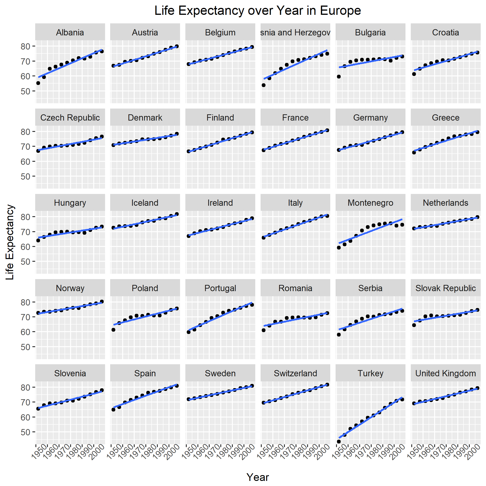

Homework 7 (Gapminder Version)
================
Yuanji Sun
November 14, 2017

Report process
==============

I learnt a lot from this exercise and am clear about how Makefile works. Below are the problems I ran into.

1.  `rm` does not work in Windows. Instead, I should use `del` to remove/clean files.
2.  It is a good idea to add the files into remove list immediately after finishing the R script. Otherwise, it takes a longer time to find out which one needs to be cleaned.
3.  It is necessary to run the R script/RMD file before finalizing the Makefile. Otherwise, it is really difficult to debug.
4.  I tried to make the last 5 figures in this report larger but I did not find a good way. If I specify the image size, I cannot keep the width/height ratio. I tried to use the package `ggplus` but it is not well developed. So I did not change the image size here.
5.  If many files of the same type will be produced, I can use `%` to represent the file name. For example, I used `%.png` in Makefile to represent all .png files generated in that step.
6.  It is good that if you render the MD file, a HTML file will also be generated automatically.

The most useful resources I used is the lecture notes (example). Following it step by step is a good way to learn.

Perform exploratory analyses
============================

In this section, I plotted two figures. Figure 1 shows the min/max GDP/cap of each continent in different years. Figure 2 shows the distribution of GDP/cap over years of each continent.


I also reordered the continent based on the life expectancy and saved the results to `exploratory_analyses.tsv`. Based on this sorted and reordered data, I make another plot which shows the average life expectancy of each continent. (You can see that the continent order is reordered already).


Perform statistical analyses
============================

In this section, I first read the sorted data from .tsv file from the previous part. The reordered continent is still in force. I made a linear model and used `broom::tidy()` to export the coefficients to a .tsv file. Let's have a look at it.

``` r
output <- read.table(file="model_result.tsv", sep="\t", skip = 1,
           col.names=c("Continent", "Country", "Term","Estimate", "Std.Error", "Statistic", "P.Value"))
knitr::kable(output)
```

| Continent | Country                  | Term             |    Estimate|  Std.Error|    Statistic|    P.Value|
|:----------|:-------------------------|:-----------------|-----------:|----------:|------------:|----------:|
| Africa    | Algeria                  | intercept        |  43.3749744|  0.7184202|   60.3754908|  0.0000000|
| Africa    | Algeria                  | I(year - offset) |   0.5692797|  0.0221271|   25.7277493|  0.0000000|
| Africa    | Angola                   | intercept        |  32.1266538|  0.7640355|   42.0486406|  0.0000000|
| Africa    | Angola                   | I(year - offset) |   0.2093399|  0.0235320|    8.8959644|  0.0000046|
| Africa    | Benin                    | intercept        |  39.5885128|  0.6378819|   62.0624528|  0.0000000|
| Africa    | Benin                    | I(year - offset) |   0.3342329|  0.0196465|   17.0123200|  0.0000000|
| Africa    | Botswana                 | intercept        |  52.9291154|  3.3190406|   15.9471131|  0.0000000|
| Africa    | Botswana                 | I(year - offset) |   0.0606685|  0.1022252|    0.5934793|  0.5660414|
| Africa    | Burkina Faso             | intercept        |  34.6846923|  1.1116136|   31.2021109|  0.0000000|
| Africa    | Burkina Faso             | I(year - offset) |   0.3639748|  0.0342373|   10.6309510|  0.0000009|
| Africa    | Burundi                  | intercept        |  40.5786410|  0.8746862|   46.3922288|  0.0000000|
| Africa    | Burundi                  | I(year - offset) |   0.1541343|  0.0269400|    5.7213903|  0.0001926|
| Africa    | Cameroon                 | intercept        |  41.2494615|  1.7611331|   23.4221154|  0.0000000|
| Africa    | Cameroon                 | I(year - offset) |   0.2501469|  0.0542422|    4.6116625|  0.0009628|
| Africa    | Central African Republic | intercept        |  38.8095128|  1.9138932|   20.2777835|  0.0000000|
| Africa    | Central African Republic | I(year - offset) |   0.1839056|  0.0589472|    3.1198368|  0.0108770|
| Africa    | Chad                     | intercept        |  39.8093718|  0.9945101|   40.0291284|  0.0000000|
| Africa    | Chad                     | I(year - offset) |   0.2532441|  0.0306305|    8.2677000|  0.0000088|
| Africa    | Comoros                  | intercept        |  39.9960000|  0.2599153|  153.8809110|  0.0000000|
| Africa    | Comoros                  | I(year - offset) |   0.4503909|  0.0080053|   56.2616474|  0.0000000|
| Africa    | Congo, Dem. Rep.         | intercept        |  41.9610769|  1.3192634|   31.8064432|  0.0000000|
| Africa    | Congo, Dem. Rep.         | I(year - offset) |   0.0939154|  0.0406328|    2.3113189|  0.0434098|
| Africa    | Congo, Rep.              | intercept        |  47.1367821|  1.9258241|   24.4761616|  0.0000000|
| Africa    | Congo, Rep.              | I(year - offset) |   0.1950958|  0.0593147|    3.2891672|  0.0081615|
| Africa    | Cote dIvoire             | intercept        |  44.8458590|  2.1316780|   21.0378205|  0.0000000|
| Africa    | Cote dIvoire             | I(year - offset) |   0.1305566|  0.0656549|    1.9885294|  0.0748035|
| Africa    | Djibouti                 | intercept        |  36.2771538|  0.6117847|   59.2972589|  0.0000000|
| Africa    | Djibouti                 | I(year - offset) |   0.3674035|  0.0188427|   19.4984162|  0.0000000|
| Africa    | Egypt                    | intercept        |  40.9680000|  0.5642996|   72.5997359|  0.0000000|
| Africa    | Egypt                    | I(year - offset) |   0.5554545|  0.0173802|   31.9590192|  0.0000000|
| Africa    | Equatorial Guinea        | intercept        |  34.4303077|  0.1784855|  192.9025844|  0.0000000|
| Africa    | Equatorial Guinea        | I(year - offset) |   0.3101706|  0.0054973|   56.4225166|  0.0000000|
| Africa    | Eritrea                  | intercept        |  35.6952692|  0.8127528|   43.9189743|  0.0000000|
| Africa    | Eritrea                  | I(year - offset) |   0.3746902|  0.0250325|   14.9681633|  0.0000000|
| Africa    | Ethiopia                 | intercept        |  36.0281538|  0.5687767|   63.3432288|  0.0000000|
| Africa    | Ethiopia                 | I(year - offset) |   0.3071853|  0.0175181|   17.5353031|  0.0000000|
| Africa    | Gabon                    | intercept        |  38.9353462|  2.2014653|   17.6861049|  0.0000000|
| Africa    | Gabon                    | I(year - offset) |   0.4467329|  0.0678043|    6.5885630|  0.0000617|
| Africa    | Gambia                   | intercept        |  28.4003718|  0.6231497|   45.5755195|  0.0000000|
| Africa    | Gambia                   | I(year - offset) |   0.5818259|  0.0191928|   30.3148395|  0.0000000|
| Africa    | Ghana                    | intercept        |  43.4927436|  0.4199135|  103.5754925|  0.0000000|
| Africa    | Ghana                    | I(year - offset) |   0.3217427|  0.0129332|   24.8773139|  0.0000000|
| Africa    | Guinea                   | intercept        |  31.5569872|  0.6493953|   48.5944181|  0.0000000|
| Africa    | Guinea                   | I(year - offset) |   0.4248308|  0.0200011|   21.2403396|  0.0000000|
| Africa    | Guinea-Bissau            | intercept        |  31.7370385|  0.3494267|   90.8260140|  0.0000000|
| Africa    | Guinea-Bissau            | I(year - offset) |   0.2717531|  0.0107622|   25.2506800|  0.0000000|
| Africa    | Kenya                    | intercept        |  47.0020385|  2.3796125|   19.7519713|  0.0000000|
| Africa    | Kenya                    | I(year - offset) |   0.2065077|  0.0732912|    2.8176343|  0.0182345|
| Africa    | Lesotho                  | intercept        |  47.3790256|  3.2222504|   14.7037068|  0.0000000|
| Africa    | Lesotho                  | I(year - offset) |   0.0955657|  0.0992441|    0.9629363|  0.3582864|
| Africa    | Liberia                  | intercept        |  39.8364231|  0.9626846|   41.3805535|  0.0000000|
| Africa    | Liberia                  | I(year - offset) |   0.0959937|  0.0296503|    3.2375267|  0.0089067|
| Africa    | Libya                    | intercept        |  42.1019359|  0.8361903|   50.3497075|  0.0000000|
| Africa    | Libya                    | I(year - offset) |   0.6255357|  0.0257543|   24.2885507|  0.0000000|
| Africa    | Madagascar               | intercept        |  36.6680641|  0.3039041|  120.6567019|  0.0000000|
| Africa    | Madagascar               | I(year - offset) |   0.4037280|  0.0093601|   43.1327301|  0.0000000|
| Africa    | Malawi                   | intercept        |  36.9103718|  1.0497440|   35.1613060|  0.0000000|
| Africa    | Malawi                   | I(year - offset) |   0.2342259|  0.0323317|    7.2444611|  0.0000278|
| Africa    | Mali                     | intercept        |  33.0512308|  0.2615203|  126.3811188|  0.0000000|
| Africa    | Mali                     | I(year - offset) |   0.3768098|  0.0080547|   46.7812021|  0.0000000|
| Africa    | Mauritania               | intercept        |  40.0256026|  0.2212986|  180.8669510|  0.0000000|
| Africa    | Mauritania               | I(year - offset) |   0.4464175|  0.0068159|   65.4963612|  0.0000000|
| Africa    | Mauritius                | intercept        |  55.3707692|  0.9449728|   58.5950916|  0.0000000|
| Africa    | Mauritius                | I(year - offset) |   0.3484538|  0.0291048|   11.9723825|  0.0000003|
| Africa    | Morocco                  | intercept        |  42.6908333|  0.4110424|  103.8599306|  0.0000000|
| Africa    | Morocco                  | I(year - offset) |   0.5424727|  0.0126599|   42.8495183|  0.0000000|
| Africa    | Mozambique               | intercept        |  34.2061538|  1.2444557|   27.4868403|  0.0000000|
| Africa    | Mozambique               | I(year - offset) |   0.2244853|  0.0383288|    5.8568372|  0.0001601|
| Africa    | Namibia                  | intercept        |  47.1343333|  2.6938198|   17.4972109|  0.0000000|
| Africa    | Namibia                  | I(year - offset) |   0.2311636|  0.0829686|    2.7861572|  0.0192463|
| Africa    | Niger                    | intercept        |  35.1506667|  1.1858317|   29.6422065|  0.0000000|
| Africa    | Niger                    | I(year - offset) |   0.3421091|  0.0365232|    9.3669072|  0.0000029|
| Africa    | Nigeria                  | intercept        |  37.8595256|  0.8254019|   45.8679918|  0.0000000|
| Africa    | Nigeria                  | I(year - offset) |   0.2080657|  0.0254221|    8.1844549|  0.0000096|
| Africa    | Reunion                  | intercept        |  53.9975385|  0.8848614|   61.0237263|  0.0000000|
| Africa    | Reunion                  | I(year - offset) |   0.4598804|  0.0272534|   16.8742438|  0.0000000|
| Africa    | Rwanda                   | intercept        |  42.7419487|  3.5612780|   12.0018569|  0.0000003|
| Africa    | Rwanda                   | I(year - offset) |  -0.0458315|  0.1096860|   -0.4178424|  0.6848927|
| Africa    | Sao Tome and Principe    | intercept        |  48.5275641|  0.7569984|   64.1052436|  0.0000000|
| Africa    | Sao Tome and Principe    | I(year - offset) |   0.3406825|  0.0233153|   14.6119962|  0.0000000|
| Africa    | Senegal                  | intercept        |  36.7466667|  0.5062917|   72.5800250|  0.0000000|
| Africa    | Senegal                  | I(year - offset) |   0.5047000|  0.0155936|   32.3658568|  0.0000000|
| Africa    | Sierra Leone             | intercept        |  30.8832051|  0.4476936|   68.9829004|  0.0000000|
| Africa    | Sierra Leone             | I(year - offset) |   0.2140350|  0.0137888|   15.5223850|  0.0000000|
| Africa    | Somalia                  | intercept        |  34.6753974|  1.0117183|   34.2737665|  0.0000000|
| Africa    | Somalia                  | I(year - offset) |   0.2295734|  0.0311605|    7.3674406|  0.0000240|
| Africa    | South Africa             | intercept        |  49.3412821|  2.5762850|   19.1521055|  0.0000000|
| Africa    | South Africa             | I(year - offset) |   0.1691594|  0.0793486|    2.1318516|  0.0588374|
| Africa    | Sudan                    | intercept        |  37.8741923|  0.3497480|  108.2899596|  0.0000000|
| Africa    | Sudan                    | I(year - offset) |   0.3827748|  0.0107721|   35.5338953|  0.0000000|
| Africa    | Swaziland                | intercept        |  46.3878590|  3.6078810|   12.8573693|  0.0000002|
| Africa    | Swaziland                | I(year - offset) |   0.0950748|  0.1111214|    0.8555945|  0.4122530|
| Africa    | Tanzania                 | intercept        |  43.1084103|  0.9962395|   43.2711308|  0.0000000|
| Africa    | Tanzania                 | I(year - offset) |   0.1746881|  0.0306838|    5.6931710|  0.0002002|
| Africa    | Togo                     | intercept        |  40.9774615|  1.2667493|   32.3485165|  0.0000000|
| Africa    | Togo                     | I(year - offset) |   0.3825923|  0.0390154|    9.8061875|  0.0000019|
| Africa    | Tunisia                  | intercept        |  44.5553077|  0.8466003|   52.6285040|  0.0000000|
| Africa    | Tunisia                  | I(year - offset) |   0.5878434|  0.0260750|   22.5443559|  0.0000000|
| Africa    | Uganda                   | intercept        |  44.2752179|  1.7309708|   25.5782581|  0.0000000|
| Africa    | Uganda                   | I(year - offset) |   0.1215860|  0.0533132|    2.2805968|  0.0457393|
| Africa    | Zambia                   | intercept        |  47.6580256|  2.4591861|   19.3795930|  0.0000000|
| Africa    | Zambia                   | I(year - offset) |  -0.0604252|  0.0757420|   -0.7977764|  0.4435318|
| Africa    | Zimbabwe                 | intercept        |  55.2212436|  3.9127001|   14.1133340|  0.0000001|
| Africa    | Zimbabwe                 | I(year - offset) |  -0.0930210|  0.1205097|   -0.7718963|  0.4580290|
| Asia      | Afghanistan              | intercept        |  29.9072949|  0.6639995|   45.0411380|  0.0000000|
| Asia      | Afghanistan              | I(year - offset) |   0.2753287|  0.0204509|   13.4628901|  0.0000001|
| Asia      | Bahrain                  | intercept        |  52.7492051|  0.8903299|   59.2468082|  0.0000000|
| Asia      | Bahrain                  | I(year - offset) |   0.4675077|  0.0274218|   17.0487460|  0.0000000|
| Asia      | Bangladesh               | intercept        |  36.1354872|  0.5303636|   68.1334197|  0.0000000|
| Asia      | Bangladesh               | I(year - offset) |   0.4981308|  0.0163350|   30.4946941|  0.0000000|
| Asia      | Cambodia                 | intercept        |  37.0154231|  3.0572859|   12.1072821|  0.0000003|
| Asia      | Cambodia                 | I(year - offset) |   0.3959028|  0.0941632|    4.2044303|  0.0018159|
| Asia      | China                    | intercept        |  47.1904815|  2.0944268|   22.5314547|  0.0000000|
| Asia      | China                    | I(year - offset) |   0.5307149|  0.0645075|    8.2271744|  0.0000092|
| Asia      | Hong Kong, China         | intercept        |  63.4286410|  0.6341995|  100.0137073|  0.0000000|
| Asia      | Hong Kong, China         | I(year - offset) |   0.3659706|  0.0195331|   18.7359186|  0.0000000|
| Asia      | India                    | intercept        |  39.2697564|  0.9366533|   41.9256055|  0.0000000|
| Asia      | India                    | I(year - offset) |   0.5053210|  0.0288486|   17.5163294|  0.0000000|
| Asia      | Indonesia                | intercept        |  36.8831154|  0.3505460|  105.2161840|  0.0000000|
| Asia      | Indonesia                | I(year - offset) |   0.6346413|  0.0107967|   58.7811248|  0.0000000|
| Asia      | Iran                     | intercept        |  44.9789872|  0.3609096|  124.6267312|  0.0000000|
| Asia      | Iran                     | I(year - offset) |   0.4966399|  0.0111159|   44.6784137|  0.0000000|
| Asia      | Iraq                     | intercept        |  50.1134615|  2.2030886|   22.7469116|  0.0000000|
| Asia      | Iraq                     | I(year - offset) |   0.2352105|  0.0678543|    3.4664055|  0.0060574|
| Asia      | Israel                   | intercept        |  66.3004103|  0.1986046|  333.8312655|  0.0000000|
| Asia      | Israel                   | I(year - offset) |   0.2671063|  0.0061169|   43.6666177|  0.0000000|
| Asia      | Japan                    | intercept        |  65.1220513|  0.7435009|   87.5883981|  0.0000000|
| Asia      | Japan                    | I(year - offset) |   0.3529042|  0.0228995|   15.4109699|  0.0000000|
| Asia      | Jordan                   | intercept        |  44.0638590|  1.0367579|   42.5015888|  0.0000000|
| Asia      | Jordan                   | I(year - offset) |   0.5717294|  0.0319318|   17.9047301|  0.0000000|
| Asia      | Korea, Dem. Rep.         | intercept        |  54.9056026|  2.1113613|   26.0048349|  0.0000000|
| Asia      | Korea, Dem. Rep.         | I(year - offset) |   0.3164266|  0.0650291|    4.8659207|  0.0006556|
| Asia      | Korea, Rep.              | intercept        |  49.7275000|  0.6376384|   77.9869873|  0.0000000|
| Asia      | Korea, Rep.              | I(year - offset) |   0.5554000|  0.0196390|   28.2804316|  0.0000000|
| Asia      | Kuwait                   | intercept        |  57.4593333|  0.9572671|   60.0243447|  0.0000000|
| Asia      | Kuwait                   | I(year - offset) |   0.4168364|  0.0294835|   14.1379709|  0.0000001|
| Asia      | Lebanon                  | intercept        |  58.6873590|  0.6666838|   88.0287817|  0.0000000|
| Asia      | Lebanon                  | I(year - offset) |   0.2610294|  0.0205336|   12.7123002|  0.0000002|
| Asia      | Malaysia                 | intercept        |  51.5052179|  1.1338366|   45.4256107|  0.0000000|
| Asia      | Malaysia                 | I(year - offset) |   0.4645224|  0.0349217|   13.3018126|  0.0000001|
| Asia      | Mongolia                 | intercept        |  43.8264103|  0.5105767|   85.8370783|  0.0000000|
| Asia      | Mongolia                 | I(year - offset) |   0.4386881|  0.0157256|   27.8964880|  0.0000000|
| Asia      | Myanmar                  | intercept        |  41.4115513|  1.6468893|   25.1453162|  0.0000000|
| Asia      | Myanmar                  | I(year - offset) |   0.4330951|  0.0507236|    8.5383414|  0.0000066|
| Asia      | Nepal                    | intercept        |  34.4316410|  0.5018926|   68.6035998|  0.0000000|
| Asia      | Nepal                    | I(year - offset) |   0.5292615|  0.0154581|   34.2384549|  0.0000000|
| Asia      | Oman                     | intercept        |  37.2077436|  1.2748610|   29.1857262|  0.0000000|
| Asia      | Oman                     | I(year - offset) |   0.7721790|  0.0392652|   19.6657180|  0.0000000|
| Asia      | Pakistan                 | intercept        |  43.7229615|  0.2188015|  199.8293669|  0.0000000|
| Asia      | Pakistan                 | I(year - offset) |   0.4057923|  0.0067390|   60.2154854|  0.0000000|
| Asia      | Philippines              | intercept        |  49.4043462|  0.4015479|  123.0347550|  0.0000000|
| Asia      | Philippines              | I(year - offset) |   0.4204692|  0.0123675|   33.9978547|  0.0000000|
| Asia      | Saudi Arabia             | intercept        |  40.8141154|  1.1302842|   36.1096035|  0.0000000|
| Asia      | Saudi Arabia             | I(year - offset) |   0.6496231|  0.0348123|   18.6607208|  0.0000000|
| Asia      | Singapore                | intercept        |  61.8458846|  0.3865763|  159.9836319|  0.0000000|
| Asia      | Singapore                | I(year - offset) |   0.3408860|  0.0119064|   28.6304760|  0.0000000|
| Asia      | Sri Lanka                | intercept        |  59.7914872|  0.5905879|  101.2406291|  0.0000000|
| Asia      | Sri Lanka                | I(year - offset) |   0.2448944|  0.0181899|   13.4632213|  0.0000001|
| Asia      | Syria                    | intercept        |  46.1012821|  0.7219705|   63.8548013|  0.0000000|
| Asia      | Syria                    | I(year - offset) |   0.5543594|  0.0222364|   24.9302505|  0.0000000|
| Asia      | Taiwan                   | intercept        |  61.3374359|  0.7115902|   86.1977012|  0.0000000|
| Asia      | Taiwan                   | I(year - offset) |   0.3272448|  0.0219167|   14.9312924|  0.0000000|
| Asia      | Thailand                 | intercept        |  52.6564231|  0.6542710|   80.4810618|  0.0000000|
| Asia      | Thailand                 | I(year - offset) |   0.3470483|  0.0201513|   17.2221292|  0.0000000|
| Asia      | Vietnam                  | intercept        |  39.0100769|  0.7133390|   54.6865858|  0.0000000|
| Asia      | Vietnam                  | I(year - offset) |   0.6716154|  0.0219706|   30.5688625|  0.0000000|
| Asia      | West Bank and Gaza       | intercept        |  43.7983974|  1.0763665|   40.6909686|  0.0000000|
| Asia      | West Bank and Gaza       | I(year - offset) |   0.6011007|  0.0331517|   18.1318318|  0.0000000|
| Asia      | Yemen, Rep.              | intercept        |  30.1302821|  0.8611216|   34.9895779|  0.0000000|
| Asia      | Yemen, Rep.              | I(year - offset) |   0.6054594|  0.0265222|   22.8283857|  0.0000000|
| Americas  | Argentina                | intercept        |  62.6884359|  0.1587289|  394.9401840|  0.0000000|
| Americas  | Argentina                | I(year - offset) |   0.2317084|  0.0048888|   47.3958474|  0.0000000|
| Americas  | Bolivia                  | intercept        |  38.7564487|  0.6431784|   60.2576941|  0.0000000|
| Americas  | Bolivia                  | I(year - offset) |   0.4999322|  0.0198097|   25.2367982|  0.0000000|
| Americas  | Brazil                   | intercept        |  51.5120385|  0.1771529|  290.7772493|  0.0000000|
| Americas  | Brazil                   | I(year - offset) |   0.3900895|  0.0054562|   71.4941652|  0.0000000|
| Americas  | Canada                   | intercept        |  68.8838462|  0.1353471|  508.9423360|  0.0000000|
| Americas  | Canada                   | I(year - offset) |   0.2188692|  0.0041686|   52.5037764|  0.0000000|
| Americas  | Chile                    | intercept        |  54.3177051|  0.6477388|   83.8574234|  0.0000000|
| Americas  | Chile                    | I(year - offset) |   0.4768441|  0.0199501|   23.9018278|  0.0000000|
| Americas  | Colombia                 | intercept        |  53.4271154|  0.7122259|   75.0142863|  0.0000000|
| Americas  | Colombia                 | I(year - offset) |   0.3807503|  0.0219363|   17.3571016|  0.0000000|
| Americas  | Costa Rica               | intercept        |  59.1047051|  0.8247668|   71.6623257|  0.0000000|
| Americas  | Costa Rica               | I(year - offset) |   0.4027895|  0.0254025|   15.8562920|  0.0000000|
| Americas  | Cuba                     | intercept        |  62.2134487|  0.9452051|   65.8200486|  0.0000000|
| Americas  | Cuba                     | I(year - offset) |   0.3211503|  0.0291120|   11.0315608|  0.0000006|
| Americas  | Dominican Republic       | intercept        |  48.5978077|  0.8418024|   57.7306625|  0.0000000|
| Americas  | Dominican Republic       | I(year - offset) |   0.4711524|  0.0259272|   18.1721350|  0.0000000|
| Americas  | Ecuador                  | intercept        |  49.0653718|  0.3794927|  129.2919981|  0.0000000|
| Americas  | Ecuador                  | I(year - offset) |   0.5000531|  0.0116882|   42.7826181|  0.0000000|
| Americas  | El Salvador              | intercept        |  46.5119487|  1.0550820|   44.0837280|  0.0000000|
| Americas  | El Salvador              | I(year - offset) |   0.4771413|  0.0324961|   14.6830200|  0.0000000|
| Americas  | Guatemala                | intercept        |  42.1193974|  0.3155924|  133.4613956|  0.0000000|
| Americas  | Guatemala                | I(year - offset) |   0.5312734|  0.0097201|   54.6570573|  0.0000000|
| Americas  | Haiti                    | intercept        |  39.2461538|  0.4565534|   85.9617962|  0.0000000|
| Americas  | Haiti                    | I(year - offset) |   0.3970580|  0.0140617|   28.2369000|  0.0000000|
| Americas  | Honduras                 | intercept        |  42.9924103|  0.8494393|   50.6126916|  0.0000000|
| Americas  | Honduras                 | I(year - offset) |   0.5428517|  0.0261624|   20.7493034|  0.0000000|
| Americas  | Jamaica                  | intercept        |  62.6609872|  1.1164205|   56.1266880|  0.0000000|
| Americas  | Jamaica                  | I(year - offset) |   0.2213944|  0.0343853|    6.4386299|  0.0000746|
| Americas  | Mexico                   | intercept        |  53.0053718|  0.5675020|   93.4012083|  0.0000000|
| Americas  | Mexico                   | I(year - offset) |   0.4510350|  0.0174788|   25.8046195|  0.0000000|
| Americas  | Nicaragua                | intercept        |  43.0451282|  0.3249554|  132.4647330|  0.0000000|
| Americas  | Nicaragua                | I(year - offset) |   0.5565196|  0.0100085|   55.6046808|  0.0000000|
| Americas  | Panama                   | intercept        |  58.0610000|  0.8237795|   70.4812405|  0.0000000|
| Americas  | Panama                   | I(year - offset) |   0.3542091|  0.0253721|   13.9605771|  0.0000001|
| Americas  | Paraguay                 | intercept        |  62.4818333|  0.2125480|  293.9657785|  0.0000000|
| Americas  | Paraguay                 | I(year - offset) |   0.1573545|  0.0065464|   24.0368163|  0.0000000|
| Americas  | Peru                     | intercept        |  44.3476410|  0.5850548|   75.8008372|  0.0000000|
| Americas  | Peru                     | I(year - offset) |   0.5276979|  0.0180195|   29.2848825|  0.0000000|
| Americas  | Puerto Rico              | intercept        |  66.9485256|  0.6889407|   97.1760333|  0.0000000|
| Americas  | Puerto Rico              | I(year - offset) |   0.2105748|  0.0212191|    9.9238282|  0.0000017|
| Americas  | Trinidad and Tobago      | intercept        |  62.0523077|  0.8970621|   69.1728140|  0.0000000|
| Americas  | Trinidad and Tobago      | I(year - offset) |   0.1736615|  0.0276292|    6.2854415|  0.0000908|
| Americas  | United States            | intercept        |  68.4138462|  0.2259695|  302.7570359|  0.0000000|
| Americas  | United States            | I(year - offset) |   0.1841692|  0.0069598|   26.4619565|  0.0000000|
| Americas  | Uruguay                  | intercept        |  65.7416026|  0.2897994|  226.8521098|  0.0000000|
| Americas  | Uruguay                  | I(year - offset) |   0.1832720|  0.0089257|   20.5330451|  0.0000000|
| Americas  | Venezuela                | intercept        |  57.5133205|  0.8046498|   71.4762155|  0.0000000|
| Americas  | Venezuela                | I(year - offset) |   0.3297217|  0.0247829|   13.3043986|  0.0000001|
| Europe    | Albania                  | intercept        |  59.2291282|  1.0768440|   55.0025133|  0.0000000|
| Europe    | Albania                  | I(year - offset) |   0.3346832|  0.0331664|   10.0910363|  0.0000015|
| Europe    | Austria                  | intercept        |  66.4484615|  0.2212318|  300.3566755|  0.0000000|
| Europe    | Austria                  | I(year - offset) |   0.2419923|  0.0068139|   35.5147334|  0.0000000|
| Europe    | Belgium                  | intercept        |  67.8919231|  0.1590522|  426.8530986|  0.0000000|
| Europe    | Belgium                  | I(year - offset) |   0.2090846|  0.0048987|   42.6812417|  0.0000000|
| Europe    | Bosnia and Herzegovina   | intercept        |  58.0895641|  1.2254165|   47.4039345|  0.0000000|
| Europe    | Bosnia and Herzegovina   | I(year - offset) |   0.3497552|  0.0377424|    9.2669143|  0.0000032|
| Europe    | Bulgaria                 | intercept        |  65.7373077|  1.3625030|   48.2474602|  0.0000000|
| Europe    | Bulgaria                 | I(year - offset) |   0.1456888|  0.0419646|    3.4717095|  0.0060039|
| Europe    | Croatia                  | intercept        |  63.8557821|  0.6231467|  102.4731166|  0.0000000|
| Europe    | Croatia                  | I(year - offset) |   0.2254594|  0.0191927|   11.7471572|  0.0000004|
| Europe    | Czech Republic           | intercept        |  67.5280769|  0.4482597|  150.6449973|  0.0000000|
| Europe    | Czech Republic           | I(year - offset) |   0.1448154|  0.0138062|   10.4891350|  0.0000010|
| Europe    | Denmark                  | intercept        |  71.0335897|  0.2165503|  328.0235293|  0.0000000|
| Europe    | Denmark                  | I(year - offset) |   0.1213301|  0.0066697|   18.1913245|  0.0000000|
| Europe    | Finland                  | intercept        |  66.4489744|  0.1923471|  345.4638421|  0.0000000|
| Europe    | Finland                  | I(year - offset) |   0.2379252|  0.0059242|   40.1614472|  0.0000000|
| Europe    | France                   | intercept        |  67.7901282|  0.1194901|  567.3286078|  0.0000000|
| Europe    | France                   | I(year - offset) |   0.2385014|  0.0036802|   64.8057884|  0.0000000|
| Europe    | Germany                  | intercept        |  67.5681282|  0.2259399|  299.0534867|  0.0000000|
| Europe    | Germany                  | I(year - offset) |   0.2136832|  0.0069589|   30.7066214|  0.0000000|
| Europe    | Greece                   | intercept        |  67.0672051|  0.4227103|  158.6599807|  0.0000000|
| Europe    | Greece                   | I(year - offset) |   0.2423986|  0.0130193|   18.6183821|  0.0000000|
| Europe    | Hungary                  | intercept        |  65.9928205|  0.6446344|  102.3724815|  0.0000000|
| Europe    | Hungary                  | I(year - offset) |   0.1236490|  0.0198545|    6.2277564|  0.0000978|
| Europe    | Iceland                  | intercept        |  71.9635897|  0.2969278|  242.3605919|  0.0000000|
| Europe    | Iceland                  | I(year - offset) |   0.1653755|  0.0091453|   18.0831906|  0.0000000|
| Europe    | Ireland                  | intercept        |  67.5414615|  0.2594848|  260.2906377|  0.0000000|
| Europe    | Ireland                  | I(year - offset) |   0.1991196|  0.0079920|   24.9147596|  0.0000000|
| Europe    | Italy                    | intercept        |  66.5967949|  0.2262984|  294.2874934|  0.0000000|
| Europe    | Italy                    | I(year - offset) |   0.2697105|  0.0069699|   38.6964348|  0.0000000|
| Europe    | Montenegro               | intercept        |  62.2416282|  1.4953884|   41.6223816|  0.0000000|
| Europe    | Montenegro               | I(year - offset) |   0.2930014|  0.0460574|    6.3616580|  0.0000823|
| Europe    | Netherlands              | intercept        |  71.8896154|  0.1888411|  380.6884906|  0.0000000|
| Europe    | Netherlands              | I(year - offset) |   0.1366867|  0.0058162|   23.5009018|  0.0000000|
| Europe    | Norway                   | intercept        |  72.2146154|  0.2659060|  271.5794891|  0.0000000|
| Europe    | Norway                   | I(year - offset) |   0.1319413|  0.0081898|   16.1104298|  0.0000000|
| Europe    | Poland                   | intercept        |  64.7808974|  0.8803585|   73.5846779|  0.0000000|
| Europe    | Poland                   | I(year - offset) |   0.1962189|  0.0271147|    7.2366217|  0.0000280|
| Europe    | Portugal                 | intercept        |  61.1467949|  0.6188839|   98.8017144|  0.0000000|
| Europe    | Portugal                 | I(year - offset) |   0.3372014|  0.0190614|   17.6902834|  0.0000000|
| Europe    | Romania                  | intercept        |  63.9621282|  0.7939586|   80.5610377|  0.0000000|
| Europe    | Romania                  | I(year - offset) |   0.1574014|  0.0244536|    6.4367312|  0.0000747|
| Europe    | Serbia                   | intercept        |  61.5343462|  0.9728532|   63.2514188|  0.0000000|
| Europe    | Serbia                   | I(year - offset) |   0.2551510|  0.0299635|    8.5153927|  0.0000068|
| Europe    | Slovak Republic          | intercept        |  67.0098718|  0.7058347|   94.9370587|  0.0000000|
| Europe    | Slovak Republic          | I(year - offset) |   0.1340441|  0.0217394|    6.1659385|  0.0001061|
| Europe    | Slovenia                 | intercept        |  66.0863462|  0.3859981|  171.2090036|  0.0000000|
| Europe    | Slovenia                 | I(year - offset) |   0.2005238|  0.0118886|   16.8669040|  0.0000000|
| Europe    | Spain                    | intercept        |  66.4778205|  0.5501755|  120.8302077|  0.0000000|
| Europe    | Spain                    | I(year - offset) |   0.2809308|  0.0169452|   16.5787849|  0.0000000|
| Europe    | Sweden                   | intercept        |  71.6050000|  0.1149944|  622.6824663|  0.0000000|
| Europe    | Sweden                   | I(year - offset) |   0.1662545|  0.0035418|   46.9409047|  0.0000000|
| Europe    | Switzerland              | intercept        |  69.4537179|  0.1167014|  595.1402162|  0.0000000|
| Europe    | Switzerland              | I(year - offset) |   0.2222315|  0.0035944|   61.8278287|  0.0000000|
| Europe    | Turkey                   | intercept        |  46.0223205|  0.6228809|   73.8862236|  0.0000000|
| Europe    | Turkey                   | I(year - offset) |   0.4972399|  0.0191845|   25.9188383|  0.0000000|
| Europe    | United Kingdom           | intercept        |  68.8085256|  0.2400794|  286.6073191|  0.0000000|
| Europe    | United Kingdom           | I(year - offset) |   0.1859657|  0.0073944|   25.1496875|  0.0000000|
| Oceania   | Australia                | intercept        |  68.4005128|  0.3370035|  202.9667805|  0.0000000|
| Oceania   | Australia                | I(year - offset) |   0.2277238|  0.0103796|   21.9395958|  0.0000000|
| Oceania   | New Zealand              | intercept        |  68.6869231|  0.4367774|  157.2584230|  0.0000000|
| Oceania   | New Zealand              | I(year - offset) |   0.1928210|  0.0134526|   14.3333854|  0.0000001|

Based on the results above, I ordered countries in each continent **from the best to worst** according to the intercept value (lowest to largest) and saved the results in seperate .tsv file. This is the so-called best/worst countries based on my criteria. Let's have a look at the results.

Africa (from the worst to the best)

``` r
read.table(file="Africa.tsv", sep="\t", skip = 1, col.names=c("Country", "Intercept Estimate"))
```

    ##                     Country Intercept.Estimate
    ## 1                    Gambia           28.40037
    ## 2              Sierra Leone           30.88321
    ## 3                    Guinea           31.55699
    ## 4             Guinea-Bissau           31.73704
    ## 5                    Angola           32.12665
    ## 6                      Mali           33.05123
    ## 7                Mozambique           34.20615
    ## 8         Equatorial Guinea           34.43031
    ## 9                   Somalia           34.67540
    ## 10             Burkina Faso           34.68469
    ## 11                    Niger           35.15067
    ## 12                  Eritrea           35.69527
    ## 13                 Ethiopia           36.02815
    ## 14                 Djibouti           36.27715
    ## 15               Madagascar           36.66806
    ## 16                  Senegal           36.74667
    ## 17                   Malawi           36.91037
    ## 18                  Nigeria           37.85953
    ## 19                    Sudan           37.87419
    ## 20 Central African Republic           38.80951
    ## 21                    Gabon           38.93535
    ## 22                    Benin           39.58851
    ## 23                     Chad           39.80937
    ## 24                  Liberia           39.83642
    ## 25                  Comoros           39.99600
    ## 26               Mauritania           40.02560
    ## 27                  Burundi           40.57864
    ## 28                    Egypt           40.96800
    ## 29                     Togo           40.97746
    ## 30                 Cameroon           41.24946
    ## 31         Congo, Dem. Rep.           41.96108
    ## 32                    Libya           42.10194
    ## 33                  Morocco           42.69083
    ## 34                   Rwanda           42.74195
    ## 35                 Tanzania           43.10841
    ## 36                  Algeria           43.37497
    ## 37                    Ghana           43.49274
    ## 38                   Uganda           44.27522
    ## 39                  Tunisia           44.55531
    ## 40             Cote dIvoire           44.84586
    ## 41                Swaziland           46.38786
    ## 42                    Kenya           47.00204
    ## 43                  Namibia           47.13433
    ## 44              Congo, Rep.           47.13678
    ## 45                  Lesotho           47.37903
    ## 46                   Zambia           47.65803
    ## 47    Sao Tome and Principe           48.52756
    ## 48             South Africa           49.34128
    ## 49                 Botswana           52.92912
    ## 50                  Reunion           53.99754
    ## 51                 Zimbabwe           55.22124
    ## 52                Mauritius           55.37077

Americas (from the worst to the best)

``` r
read.table(file="Americas.tsv", sep="\t", skip = 1, col.names=c("Country", "Intercept Estimate"))
```

    ##                Country Intercept.Estimate
    ## 1              Bolivia           38.75645
    ## 2                Haiti           39.24615
    ## 3            Guatemala           42.11940
    ## 4             Honduras           42.99241
    ## 5            Nicaragua           43.04513
    ## 6                 Peru           44.34764
    ## 7          El Salvador           46.51195
    ## 8   Dominican Republic           48.59781
    ## 9              Ecuador           49.06537
    ## 10              Brazil           51.51204
    ## 11              Mexico           53.00537
    ## 12            Colombia           53.42712
    ## 13               Chile           54.31771
    ## 14           Venezuela           57.51332
    ## 15              Panama           58.06100
    ## 16          Costa Rica           59.10471
    ## 17 Trinidad and Tobago           62.05231
    ## 18                Cuba           62.21345
    ## 19            Paraguay           62.48183
    ## 20             Jamaica           62.66099
    ## 21           Argentina           62.68844
    ## 22             Uruguay           65.74160
    ## 23         Puerto Rico           66.94853
    ## 24       United States           68.41385
    ## 25              Canada           68.88385

Asia (from the worst to the best)

``` r
read.table(file="Asia.tsv", sep="\t", skip = 1, col.names=c("Country", "Intercept Estimate"))
```

    ##               Country Intercept.Estimate
    ## 1         Afghanistan           29.90729
    ## 2         Yemen, Rep.           30.13028
    ## 3               Nepal           34.43164
    ## 4          Bangladesh           36.13549
    ## 5           Indonesia           36.88312
    ## 6            Cambodia           37.01542
    ## 7                Oman           37.20774
    ## 8             Vietnam           39.01008
    ## 9               India           39.26976
    ## 10       Saudi Arabia           40.81412
    ## 11            Myanmar           41.41155
    ## 12           Pakistan           43.72296
    ## 13 West Bank and Gaza           43.79840
    ## 14           Mongolia           43.82641
    ## 15             Jordan           44.06386
    ## 16               Iran           44.97899
    ## 17              Syria           46.10128
    ## 18              China           47.19048
    ## 19        Philippines           49.40435
    ## 20        Korea, Rep.           49.72750
    ## 21               Iraq           50.11346
    ## 22           Malaysia           51.50522
    ## 23           Thailand           52.65642
    ## 24            Bahrain           52.74921
    ## 25   Korea, Dem. Rep.           54.90560
    ## 26             Kuwait           57.45933
    ## 27            Lebanon           58.68736
    ## 28          Sri Lanka           59.79149
    ## 29             Taiwan           61.33744
    ## 30          Singapore           61.84588
    ## 31   Hong Kong, China           63.42864
    ## 32              Japan           65.12205
    ## 33             Israel           66.30041

Europe (from the worst to the best)

``` r
read.table(file="Europe.tsv", sep="\t", skip = 1, col.names=c("Country", "Intercept Estimate"))
```

    ##                   Country Intercept.Estimate
    ## 1                  Turkey           46.02232
    ## 2  Bosnia and Herzegovina           58.08956
    ## 3                 Albania           59.22913
    ## 4                Portugal           61.14679
    ## 5                  Serbia           61.53435
    ## 6              Montenegro           62.24163
    ## 7                 Croatia           63.85578
    ## 8                 Romania           63.96213
    ## 9                  Poland           64.78090
    ## 10               Bulgaria           65.73731
    ## 11                Hungary           65.99282
    ## 12               Slovenia           66.08635
    ## 13                Austria           66.44846
    ## 14                Finland           66.44897
    ## 15                  Spain           66.47782
    ## 16                  Italy           66.59679
    ## 17        Slovak Republic           67.00987
    ## 18                 Greece           67.06721
    ## 19         Czech Republic           67.52808
    ## 20                Ireland           67.54146
    ## 21                Germany           67.56813
    ## 22                 France           67.79013
    ## 23                Belgium           67.89192
    ## 24         United Kingdom           68.80853
    ## 25            Switzerland           69.45372
    ## 26                Denmark           71.03359
    ## 27                 Sweden           71.60500
    ## 28            Netherlands           71.88962
    ## 29                Iceland           71.96359
    ## 30                 Norway           72.21462

Oceania (from the worst to the best)

``` r
read.table(file="Oceania.tsv", sep="\t", skip = 1, col.names=c("Country", "Intercept Estimate"))
```

    ##       Country Intercept.Estimate
    ## 1   Australia           68.40051
    ## 2 New Zealand           68.68692

Generate figures
================

In this section, I created a figure for each continent, and wrote one file per continent, with an informative name. The figure gives scatterplots of life expectancy vs. year, faceting on country, fitted line overlaid. Here are the figures.





Automate the pipeline
=====================

Since I am using Makefile, there is no need to use `source()`. I made this report.RMD file to put everything together and generate the final report. To update/run all files automatially, simply choose "Build All" to run the Makefile.

\[This is the end of Homework 7 (Gapminder Version).\]
